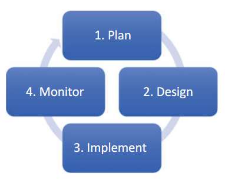

- evolving process involving learning and adaption
- **Overall** objectives:
	- short-term decisions contribute to long-term objectives
	- pathways successive decision points rather than aim for final solution
	- seek and value flexibility in individual mesaures
	- aim for synergies with goals and development initiatives by public and private parties
- core **elements**:
	- Management objectives are regularly revisited and revised
	- A model of the system being managed
	- range of management choices
	- Monitoring and evaluating outcomes
	- Mechanism for incorporating learning into future decisions
	- collaborative structure for stakeholder participation and learning
- core **principles**:
	- Identification of competing hypotheses
	- use of models that embed these hypotheses
	- monitoring of actual resource responses
	- Comparison of actual versus predicted responses
- **Condition** for Using Adaptive Management
	- management is required despite uncertainty
	- clear and measurable objectives to guide decisionmaking
	- opportunity to apply learning to management
	- Monitoring can reduce uncertainty
	- sustained commitment to stakeholders
- Climate **Change Adaptation **
	- Types of uncertainty:
		- Natural uncertainty (randomness in nature)
		- Knowledge uncertainty (state of knowledge)
		- Decision uncertainty
	- **Non-regret actions** are activities and policies that support economic, environmental, or social development goals even if climate change impacts never eventuate, that ensure
		- climate variability
		- non-climate drivers of risk
		- resilience to shocks
		- co-benefits
- Can handle [[Natural Resource Management]]
- **Components:**
	- 
	-