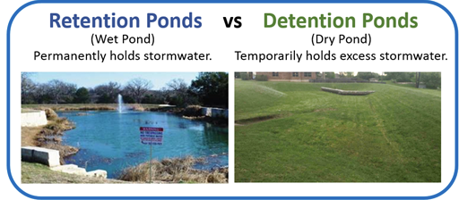
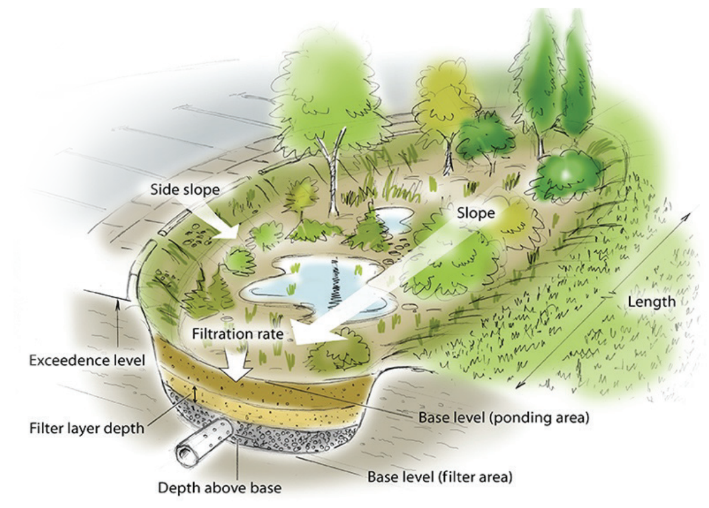
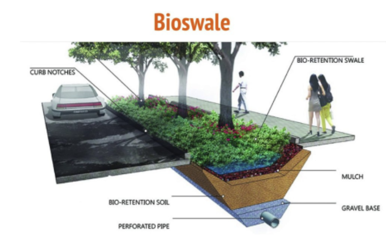

- **Stormwater Detention or Retention Basins**
	- Detention ponds temporarily store stormwater runoff during a rain event and release it later at a controlled rate to the drainage system
	- Retention ponds maintain a permanent pool of water; designed for peak runoff control, pre-treatment, water quality improvement, wildlife habitat, and aesthetic purposes
	- 
	-
- **Bioretention Basins or Rain Gardens**
	- {:height 205, :width 371}
	-
	- Both capture, filter, and infiltrate stormwater runoff but vary in scale and complexity
	- **Bioretention basins**: designed for larger impervious areas (parking lots, streets); complex structure with inflow area, pre-treatment zone, filter bed with engineered soil mix, and underdrain system
	- **Rain gardens**: smaller, residential-scale; manage runoff from rooftops, sidewalks, and driveways; include drainage area, distribution system, and receiving area with vegetation and soil layers
- **Vegetated and Bioretention Swales**
	- {:height 200, :width 448}
	-
	- **Vegetated swales**: open conveyance **channels** that convey stormwater via overland flow while providing green space; slow stormwater flow, enabling sediments and pollutants to settle; mainly removes coarse materials; can provide pre-treatment when combined with bioretention systems
	- **Bioretention swales**: provide additional stormwater quality improvements via infiltration through filter media with cleansed runoff collected via subsoil perforated pipe; also provide temporary surface detention of runoff, helping to reduce peak flows
- ---
- Benefits: [[Stormwater Detention and Retention Systems Benefits]]
- Literature: Blue and Green Cities: The Role of Blue-Green Infrastructure in Managing Urban Water Resources | Springer Nature Link (Chapter 3, pp. 44–46)