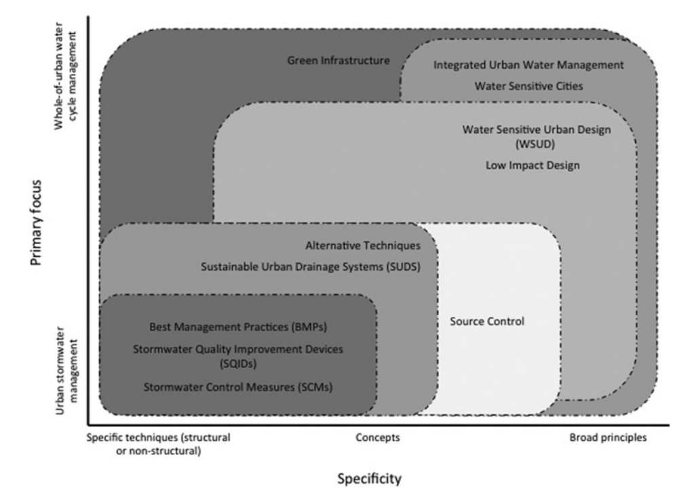
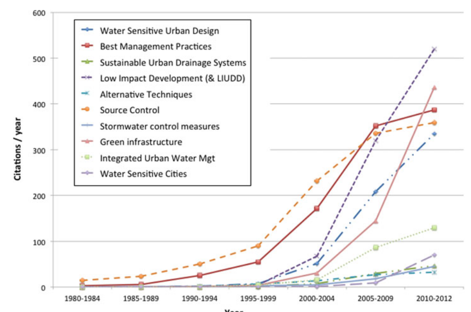

- 
-
- **### Low Impact Development (LID) / Low Impact Urban Design and Development (LIUDD)**
  
  **Current definition:** A mainstream stormwater management approach in North America using small-scale, distributed practices (bioretention, green roofs, swales) to restore pre-development hydrology — including runoff volume, infiltration, and evapotranspiration — across a catchment. Codified in legislation in the USA and Canada.
- **1977 (origin):** First used by Barlow et al. in Vermont to describe land use planning that minimised costs via a "design with nature" approach; resonated with environmentally sensitive area (ESA) planning.
- **Early 1990s (Prince George's County):** Applied in Maryland to distinguish site-design and catchment-wide approaches from conventional end-of-pipe detention; characterised by small-scale at-source devices.
- **Late 1990s (drift in meaning):** Influenced by the design community, LID came to mean any set of practices treating stormwater, often in catchments ≤1 ha — straying from its original hydrologic restoration intent.
- **2005–2010 (re-clarification):** US researchers pushed to restore the original meaning; newer manuals re-established hydrologic targets for retrofit and new developments.
- **New Zealand variant (LIUDD):** Emphasis shifted to site design to avoid pollution and ecosystem health; integrated Maori perspectives on environment under the brand Low Impact Urban Design and Development.
  
  ---
  
  **### Water Sensitive Urban Design (WSUD)**
  
  **Current definition:** A philosophical approach to urban planning and design that integrates all aspects of the urban water cycle (stormwater, water supply, wastewater). In Australia it is paired with *water sensitive cities* — WSUD describes the process; water sensitive city describes the destination.
- **1992–1994 (origin, Western Australia):** First used by Mouritz (1992) and Whelans et al. (1994); objectives focused on water balance, water quality, water conservation, and water-related environmental/recreational opportunities.
- **Early 2000s (refined scope):** Lloyd et al. (2002) defined WSUD as a philosophical approach minimising hydrological impacts; stormwater management treated as a subset. Existing BMP/BPP terms retained for specific techniques.
- **Early years in practice:** Despite the broad definition, WSUD was primarily applied to stormwater management, driven by the urban drainage community.
- **Recent use:** Authors reiterated the need for the full integrated urban water cycle framing; term now used internationally (UK, New Zealand), and has inspired related concepts such as *climate sensitive urban design*.
  
  ---
  
  **### Integrated Urban Water Management (IUWM)**
  
  **Current definition:** The integrated management of water supply, groundwater, wastewater, and stormwater in an urban context, accounting for environmental, social, cultural, and economic perspectives and aiming for long-term sustainability.
- **1990s (emergence):** Derived from the broader *integrated water management* concept (Biswas, 1981); first commonly used by Geldof (1995), Harremoes (1997), Niemczynowicz (1996); Geldof proposed a logic framework addressing scale, institutional, and social aspects.
- **2000s (formalisation):** Series of position papers (Mitchell 2006; Vlachos & Braga 2001) elaborated principles; now most closely linked with WSUD, water sensitive cities, and LID.
  
  ---
  
  **### Sustainable Urban Drainage Systems (SUDS / SuDS)**
  
  **Current definition:** A range of technologies and techniques to drain stormwater in a more sustainable way than conventional solutions, configured as a management train. In England, mandated by the Flood and Water Management Act 2010 (as SuDS, dropping 'urban' to include rural contexts).
- **Late 1980s–1992 (precursor):** UK started changing stormwater management approaches; CIRIA published "Scope for Control of Urban Runoff" guidance on technical control options.
- **1990s (Scotland leads):** Scottish EPA pushed BMP implementation in new developments; D'Arcy (1998) outlined the *sustainable drainage triangle* (quantity, quality, habitat/amenity).
- **October 1997 (term coined):** Jim Conlin of Scottish Water first used the term *sustainable urban drainage systems*; Butler & Parkinson (1997) fleshed out broader principles.
- **2000 (formalised):** CIRIA published design manuals for Scotland/Northern Ireland and England/Wales, formally establishing the term SUDS.
- **2003 (mandatory in Scotland):** SuDS became mandatory for most new developments in Scotland under WEWS (2003), primarily targeting water quality.
- **2010 (legislation in England):** Flood and Water Management Act effectively mandated SuDS in England, with a focus more on quantity than quality control.
  
  ---
  
  **### Best Management Practices (BMPs)**
  
  **Current definition:** A broadly institutionalised term (especially in North America) referring to both structural (e.g. bioretention, permeable pavement) and non-structural (e.g. good housekeeping, maintenance) practices to prevent pollution and manage stormwater quantity and quality.
- **1949 (origin):** "Better management practices" used in agriculture to restore plant cover and soil structure for usable water.
- **1972 (Clean Water Act):** BMP coined — but never explicitly defined — in the US Clean Water Act, initially focused on non-structural wastewater treatment plant operations.
- **1979–1983 (National Urban Runoff Program):** BMP performance quantified for urban stormwater in four categories: detention devices, recharge devices, housekeeping practices, and others.
- **1990 (Pollution Prevention Act):** Definition matured to a universal term for pollution prevention, encompassing both structural and non-structural attributes.
- **Early 1990s (universal adoption):** BMP adopted in nearly every US jurisdiction's stormwater design manual; the US BMP database (2002) compiled performance data used worldwide.
- **Current critique:** The superlative 'best' is acknowledged as misleading — no set standard exists against which to measure performance.
  
  ---
  
  **### Stormwater Control Measures (SCMs)**
  
  **Current definition:** A term proposed by the US National Research Council (2008) to replace BMP; refers to both structural and non-structural control measures without implying a value judgement about whether a practice is 'best'.
- **Pre-2008:** BMP recognised as too vague and often used to describe practices that were clearly not best practice.
- **2008 (NRC report):** Universal agreement among experts to adopt SCM; subsequently adopted by the US Federal Highway Administration, state departments of transportation, and academic publications.
- **Current status:** SCM has not fully replaced BMP; BMP persists in many state design manuals and in general design practice.
  
  ---
  
  **### Alternative Techniques (ATs) / Compensatory Techniques (CTs)**
  
  **Current definition:** French-origin terms (techniques alternatives / techniques compensatoires) describing decentralised, nature-based stormwater management approaches that compensate for urbanisation impacts through flow control, retention, and infiltration. The term is now becoming less favoured, displaced by source control and IUWM concepts.
- **Early 1980s (origin):** Introduced in French-speaking countries as a new urban drainage paradigm moving away from 'rapid disposal'; driven by suburban expansion costs and environmental concern; early goal was quality of life improvement alongside drainage.
- **Original concept:** ATs aimed to maintain the same flow rates as natural (pre-development) conditions — similar in intent to LID; included flow management and multi-function stormwater corridors.
- **In practice (drift):** The term became associated with all infiltration/retention-based solutions, from end-of-pipe concrete basins to vegetated source control — losing the original paradigm-shift meaning.
- **French design rules (ongoing limitation):** Design rules remain limited to hydraulic aspects (flood reduction); ecological and landscape amenity aspects are not formally incorporated; outflow thresholds applied uniformly rather than restoring pre-development water balance.
  
  ---
  
  **### Source Control**
  
  **Current definition:** An ambiguous term used in two distinct ways — (1) pollution prevention through non-structural measures (minimising pollutant sources) and (2) at-source structural stormwater treatment measures applied close to where runoff is generated. Readers must infer meaning from context.
- **Early North American use:** Distinguished on-site stormwater systems from large downstream detention basins; at-source practices treated as a subset of detention techniques targeting quantity only.
- **1985 (Ellis):** Source control summarised as non-structural and semi-structural practices focusing on pollution prevention.
- **1990s (linked to LID):** Became associated with small-scale, distributed practices to reproduce pre-development hydrology; Canadian provincial manuals formalised a hierarchy from source to end-of-pipe.
- **Definitional split:** Two meanings now coexist — pollution prevention (non-structural) vs. at-source structural treatment — the latter being a grammatical shortening of 'at-source control' over time.
  
  ---
  
  **### Green Infrastructure (GI)**
  
  **Current definition (US EPA, 2012):** An approach using vegetation and soil to manage rainwater where it falls, delivering stormwater management, flood mitigation, air quality management, and broader ecosystem services. Increasingly used almost synonymously with LID in the stormwater literature.
- **1990s (origin):** Emerged from landscape architecture (networks of green space, Benedict & McMahon 2006) and landscape ecology (Forman 1999); initially well beyond stormwater.
- **Late 1990s–2000s (stormwater link):** US EPA recognised GI's potential for stormwater management; term began to be used interchangeably with BMPs and LID.
- **Seattle (GSI):** Local variant *green stormwater infrastructure* (GSI) used in design codes requiring implementation "to the maximum extent feasible".
- **Recent broadening:** Adoption globally not only for stormwater but for urban amenity, human health, and social equity; stormwater policy and GI initiatives now reinforce each other.
  
  ---
  
  **### Stormwater Quality Improvement Devices (SQIDs)**
  
  **Current definition:** Largely obsolete term, primarily used in Australia, for devices targeting stormwater quality improvement. Use has diminished because it addresses only quality, not the combined flow and quality management goals now expected.
- **1998 (origin):** Coined by Brisbane City Council in a monitoring report; used in Australian conference literature.
- **Recent decline:** Replaced by broader frameworks that address both hydrology and water quality simultaneously.
  
  ---
  
  **### Terms in Other Languages (Section 2.11)**
  
  A selection of national terms illustrating how local context shapes terminology:
- **Sweden — LOD** (*Lokalt omhändertagande av dagvatten*): local handling of stormwater, focusing on source/site control and local infiltration; practitioners also use *öppen dagvattenavledning* (open stormwater drainage) for surface infrastructure.
- **Denmark — LAR** (*Lokal Afledning af Regnvand*, local diversion of stormwater, 1990s): recently reinterpreted as *Lokal Anvendelse af Regnvand* (local use of stormwater) to capture a wider range of technologies. Also: **VADI/WADI** for swale-trench systems (from Arabic *wadi* — ephemeral riverbed).
- **Germany:** Evolved from *Alternativen zur Regenwasserableitung* (alternatives to stormwater drainage, 1980s) → *naturnahe Regenwasserbewirtschaftung* (nature-like stormwater management, emphasising pre-development hydrology) → *dezentrale Regenwasserbewirtschaftung* (decentralised stormwater management), now the most widely used term in both technology and concept discussions.
-
-
- 
-
-
- Literature: SUDS, LID, BMPs, WSUD and more – The evolution and application of terminology surrounding urban drainage
-