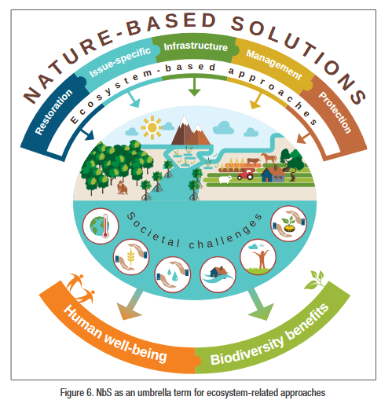

- **Source:** Cohen-Shacham et al. (2016) — Nature-based Solutions to address global societal challenges. IUCN.
- **Typology:** [[A typology of NbS applications]]
- **Categories:** [[Categories of NbS]]
- **Societal challenges addressed:** [[Societal Challenges]]
- **Lessons from practice:** [[Lessons Learned]]
- **Operational framework:** [[Toward an operational framework for NbS]]
- **SDGs:** [[Sustainable Development Goals]]
- **Protects**: [[Natural Capital]]
- 
-
- ## Overarching Goal
	- NbS are intended to **support the achievement of society's development goals** and safeguard human well-being
	- in ways that reflect **cultural and societal values**
	- and enhance the **resilience of ecosystems**, their capacity for renewal and the provision of services
	- designed to address major societal challenges: **food security, climate change, water security, human health, disaster risk, social and economic development**
- ## Definition
	- > "Actions to protect, sustainably manage, and restore natural or modified ecosystems, that address societal challenges effectively and adaptively, simultaneously providing human well-being and biodiversity benefits."
	- Key term clarifications:
		- **Ecosystems** — refers to all types, including natural and modified ecosystems
		- **Societal** — explicitly address societal challenges, not only environmental ones
		- **Actions** — underlines the need for active solutions; does NOT include interventions merely inspired by nature (e.g. biomimicry)
	- IUCN vs European Commission definition:
		- IUCN emphasises a **well-managed or restored ecosystem** at the heart of any NbS
		- EC definition is broader: "living solutions inspired by, continuously supported by and using Nature" — includes interventions inspired by but not necessarily based on nature
- ## Principles
	- Nature-based Solutions:
		- 1. **Embrace nature conservation norms** (and principles)
		- 2. Can be **implemented alone or in an integrated manner** with other solutions (e.g. technological and engineering solutions)
		- 3. Are determined by **site-specific natural and cultural contexts** that include traditional, local and scientific knowledge
		- 4. Produce societal benefits in a **fair and equitable way**, promoting transparency and broad participation
		- 5. **Maintain biological and cultural diversity** and the ability of ecosystems to evolve over time
		- 6. Are applied at a **landscape scale**
		- 7. Recognise and address the **trade-offs** between immediate economic benefits and future options for the full range of ecosystem services
		- 8. Are an **integral part of the overall design** of policies and measures to address a specific challenge
-
-