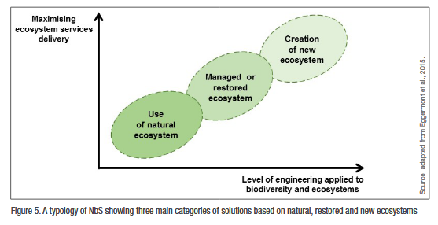

tags:: NbS
- #topic::NbS
- Source: Cohen-Shacham et al. (2016), section 1.3.2 — based on BiodivERsA ERA-NET analysis (Eggermont et al., 2015)
- 
- NbS interventions are categorised along two gradients:
	- (i) required **level of ecosystem engineering** involved
	- (ii) **level of ecosystem service enhancement** achievable
- ## Type 1 — Better use of existing natural ecosystems
	- Making better use of **existing natural or protected ecosystems**
	- Minimal engineering of biodiversity
	- Example: measures to increase fish stocks in an intact wetland to enhance food security
- ## Type 2 — Sustainable management of managed/restored ecosystems
	- Developing **sustainable management protocols** for managed or restored ecosystems
	- Moderate level of ecosystem engineering
	- Example: re-establishing traditional agro-forestry systems based on commercial tree species to support poverty alleviation
- ## Type 3 — Creating new ecosystems
	- Solutions that involve **creating new ecosystems**
	- Highest level of ecosystem engineering
	- Example: establishing green buildings (green walls, green roofs)
- ## NbS as an umbrella concept
	- NbS is an **umbrella concept** covering a wide range of ecosystem-related approaches
	- These approaches can be clustered into five main categories → see [[Categories of NbS]]
	- Most predate the emergence of NbS but generally fulfil the NbS definition
	- They share similarities in ecosystem services addressed and types of interventions involved