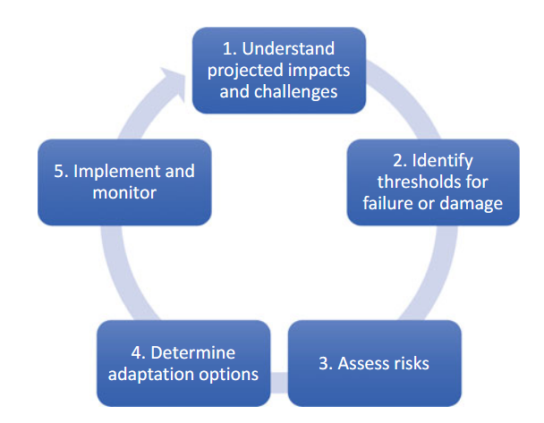

tags:: BGI
- 
- Identifying projected impacts and challenges (land use changes, populations growth,...)
- Cataloguing threshold conditions
	- for critical assets, operational components and utility origanisations systems
	- that may fail or suffer damage when challenged by climate change extreme weather events
	- determined through a review of event and performance history, modelling of system performance, or inspection of assets
- Assessing potential risks (to understand infrastructure and operations)
- Determining adaption options
	- reduce system vulnerabilities
	- Implementing and monitoring of the adaptation plan
		- new information become available
- most appropriate [[Adaptive Management Framework]]