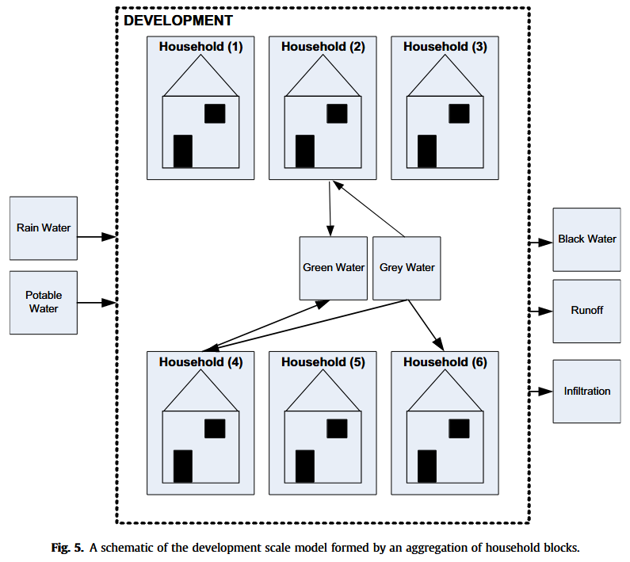
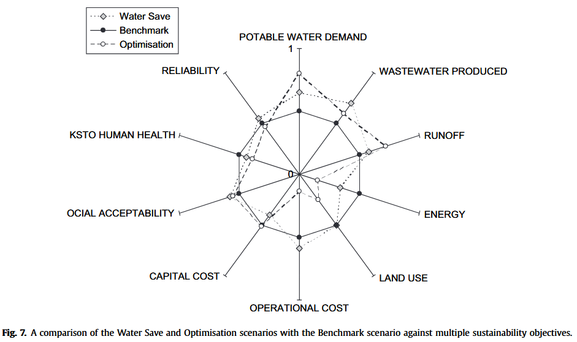

tags:: PSS

- **# Decision Support for Sustainable Option Selection in Integrated Urban Water Management**
  
  
  ---
  
  **## Context & Motivation**
  
  Conventional urban water management treats three water streams — **potable supply**, **wastewater**, and **stormwater** — as separate, independent systems. This approach misses important interdependencies and fails to exploit wastewater and rainwater as recoverable resources.
  
  With growing urbanisation (the UK needed 4+ million new households by 2016), sustainable and integrated water management approaches are increasingly necessary. However, reliable site-specific tools to support such decision-making were lacking. This paper addresses that gap.
  
  ---
  
  **## The Tool: UWOT (Urban Water Optioneering Tool)**
  
  UWOT is a prototype **decision support tool** built on **Simulink/MATLAB + Microsoft Excel**, designed to help planners select sustainable combinations of water management technologies for *new* urban developments.
  
  **### Key Components**
  
  **#### 1. Water Balance Model (Simulink)**
- Models five distinct water streams across three nested spatial scales:
- | Water Stream | Description |
  |---|---|
  | Potable (white) | Drinking-quality supply from water service provider |
  | Greywater | Wastewater from showers, basins, washing machines |
  | Greenwater | Treated rainwater or treated greywater |
  | Wastewater (blackwater) | Toilet outflow for centralised treatment |
  | Runoff | Surface water from impervious areas |
  
  **Spatial scales modelled:**
- **Micro-component** — individual appliances (toilets, showers, washing machines)
- **Household** — aggregation of appliances, with greywater/rainwater recycling switches
- **Development** — aggregation of households plus roads, SUDS, and centralised treatment facilities
  
- A **daily time-step** is used — sufficient for strategic planning without requiring detailed hydraulic modelling.
  
  **#### 2. Technology Library**
  
  An Excel-based knowledge base covering **14 technology categories** (toilets, showers, baths, washing machines, dishwashers, SUDS, greywater/rainwater treatment systems, etc.). Each entry contains:
- **Quantitative data**: water use per flush, installation costs, operational costs, energy use
- **Qualitative scores**: social acceptability, health risk, reliability — rated 0 (worst) to 5 (best)
- #### 3. Sustainability Assessment Framework
  
  Based on the **SWARD project's** four sustainability capitals:
  
  | Capital | Example Indicators |
  |---|---|
  | Environmental | Water usage, energy use, land use, environmental impact |
  | Economic | Life cycle costs, capital cost, operational cost, financial risk |
  | Social | Risks to human health, acceptability, social inclusion |
  | Technical | Performance, reliability, durability, flexibility |
  
  Indicators are standardised against a **user-defined benchmark scenario** via **Fuzzy Inference Systems (FIS)**, enabling quantitative and qualitative criteria to be meaningfully compared on the same scale.
-
- #### 4. Genetic Algorithm (GA) Optimisation
  
  A GA (using MATLAB's GA Toolbox) explores the large solution space of possible technology combinations. Users can express preferences using two aggregation methods:
- **Simple weighted averaging** — directly weight specific criteria
- **Ordered Weighted Averaging (OWA)** — reflects the decision-maker's degree of optimism or pessimism
  
  ---
- ## Two Operating Modes
  
  | Mode | Description |
  |---|---|
  | **Assessment** | User manually selects technologies; UWOT calculates the resulting water balance and sustainability scores |
  | **Optimisation** | GA automatically searches for near-optimal technology combinations given user-defined weights and constraints |
- In both modes, results are shown as **spider diagrams** across all sustainability indicators — making trade-offs explicit rather than hiding them behind a single aggregate score.
- 
- ---
- ## Case Study: Elvetham Heath, Hampshire, UK
  
  UWOT was applied to a 126 ha residential development with ~4,300 residents, planned to expand to 6,000. Three scenarios were compared:
  
  | Scenario | Approach | Per Capita Demand |
  |---|---|---|
  | **Benchmark** | Conventional appliances, no recycling | ~168 litres/capita/day (lcd) |
  | **Water Save** | Low-flow appliances, user-selected | ~109 lcd |
  | **Optimisation** | GA-driven, minimising potable demand | ~93 lcd |
  
  The optimisation scenario achieved its reduction partly through **local greywater recycling**. This also increased energy use — a trade-off the tool makes visible to decision-makers. Results confirmed the model produces reasonable water balance outputs consistent with established UK benchmarks.
  
  ---
- ## Key Design Principles
  
  1. **Wide boundaries** — Sustainability requires a broad range of metrics spanning environmental, economic, social, and technical dimensions.
  
  2. **Context-specificity** — Assessment is always relative to a local, user-defined benchmark, not a universal standard.
  
  3. **Multi-objective transparency** — Trade-offs are shown to decision-makers in disaggregated form, not collapsed into a single number.
  
  4. **Modularity** — The technology library can be extended with new technologies without reprogramming.
  
  5. **Support, not replacement** — UWOT is designed to support managerial judgment, not substitute for it (following Sprague & Carlson, 1982).
  
  ---
- ## Conclusions
  
  UWOT represents a new class of **"optioneering" tools** — software platforms for exploring complex solution spaces and supporting stakeholder negotiation. Key contributions include:
- Holistic modelling of all three urban water cycle components within a single framework
- Integration of quantitative and qualitative sustainability criteria via fuzzy logic
- GA-based optimisation to identify non-obvious solutions beyond user intuition
- Context-aware, benchmark-relative sustainability assessment
  
  As urban water management moves toward more decentralised, integrated, and context-specific solutions, tools like UWOT are expected to become standard components of planning toolkits.
  
  ---
- ## Citation
  [[R: makropoulosDecisionSupportSustainable2008a]]
-