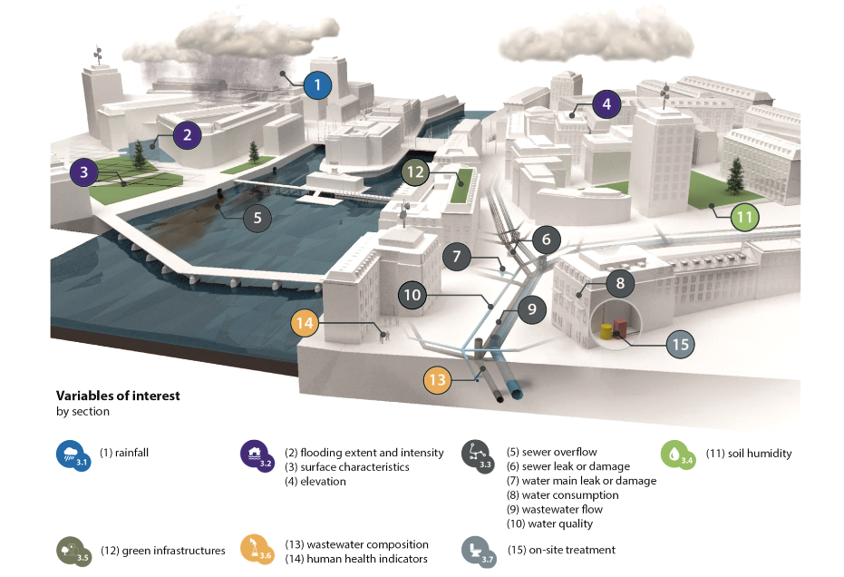
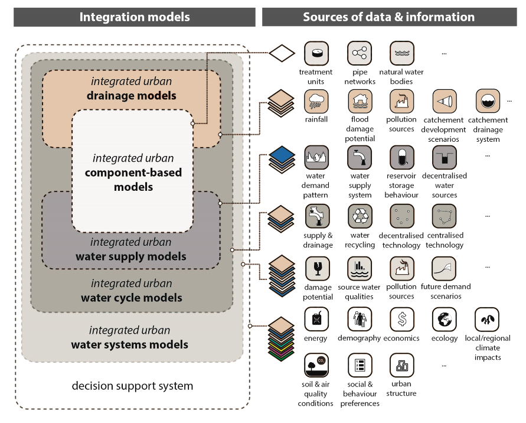

- We discuss the examples of better **rain-data management, urban pluvial flood-risk management and forecasting, drinking water and sewer network operation and management, integrated design and management, increasing water productivity, wastewater-based epidemiology** and on-site water and wastewater treatment. The accumulated evidence from literature points toward a future UWM that offers significant potential benefits thanks to increased collection and utilization of data. The findings show that data-driven UWM allows us to develop and apply **novel methods, to optimize the efficiency of the current networkbased approach**, and to extend functionality of today’s systems. However, generic challenges related to d**ata-driven approaches (e.g., data processing, data availability, data quality, data costs)** and the specific challenges of data-driven UWM need to be addressed, namely data **access and ownership, current engineering practices and the difficulty of assessing the cost benefits** of data-driven UWM.
- 
- 
-
- [[R: rauchEnablingChangeInstitutional2015]]
-
-
-