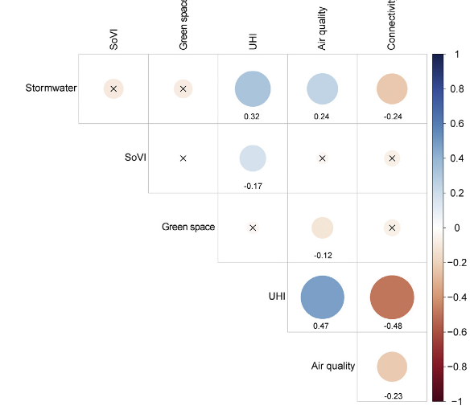
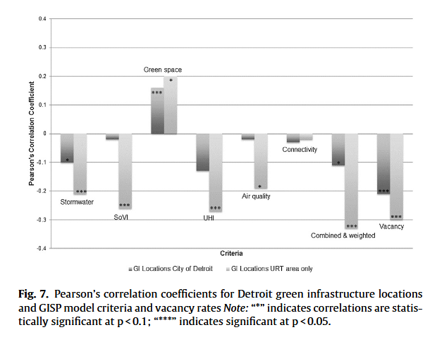

tags:: GIS-MCDA, NbS, Urban Resilience, Green Infrastructure, Trade-offs
source:: [[R: meerowSpatialPlanningMultifunctional2017a]]

- Meerow & Newell (2017) introduce the **Green Infrastructure Spatial Planning (GISP) model** — a GIS-based MCDA approach for strategically siting green infrastructure to maximise multiple ecosystem services simultaneously. Applied to Detroit as a case study.
-
- ## Core Argument
	- Green infrastructure is almost always planned for a **single benefit** (typically stormwater), even though it is promoted on the basis of **multifunctionality**. This is a missed opportunity — siting decisions have significant consequences for which communities benefit and which don't.
	- The GISP model addresses this by integrating **six ecosystem service criteria** into a spatial multi-criteria evaluation (MCE) framework: stormwater management, social vulnerability, green space access, air quality, urban heat island (UHI), and landscape connectivity.
	- Each criterion is scored 0–1 per census tract (N = 296 in Detroit), using publicly available GIS data — making the model **replicable** for other cities.
	- Stakeholders then **weight the criteria** based on local priorities. In Detroit, 23 expert stakeholders (government, NGOs, community organisations) rated, ranked, and did pairwise comparisons of the six criteria. Stormwater came out on top, followed by social vulnerability and green space access.
-
- ## Synergies and Tradeoffs (the statistical core)
	- 
	-
	- Before combining the criteria into a composite hotspot map, the authors ran **Pearson's bivariate correlations** across all 296 census tracts to test whether criteria point to the same or different parts of the city. Spearman's rank correlations were used to cross-check robustness — patterns were consistent.
	- **Synergies** (positive correlations): stormwater, UHI, and air quality tend to co-locate — so siting GI for stormwater also tends to address heat and pollution. Social vulnerability and UHI also cluster, which is concerning: the most vulnerable people are also the most heat-exposed.
	- **Tradeoffs** (negative correlations): stormwater and landscape connectivity point to *different* neighbourhoods. Optimising for ecological connectivity would place GI away from areas that need stormwater abatement, and vice versa. This is a genuinely hard planning choice that cannot be designed away — it has to be negotiated.
	- This distinction between synergies and tradeoffs matters because it is what **justifies the stakeholder weighting step**: if everything were synergistic, any weighting would give similar results. The tradeoffs are precisely why priorities have to be made explicit.
-
- ## What Detroit Actually Does (Figure 7)
	- 
	- Comparing modelled hotspots with the locations of real GI projects (DWSD, Greening of Detroit, GLRI) reveals a striking mismatch. Pearson correlations between project locations and each criterion score are **negative for almost every criterion** — meaning projects are being sited in the wrong places for stormwater, UHI, social vulnerability, air quality, and habitat connectivity.
	- The **one exception** is green space access, where the correlation is positive and significant — projects do reduce park poverty, probably incidentally.
	- Even vacancy rate shows a negative correlation — projects are *not* clustering on the most obviously available land, which is puzzling and flagged for future research.
	- The combined model scores (both equal-weighted and stakeholder-weighted) are significantly negatively correlated with project locations. **No matter how you aggregate the model, current siting is misaligned.**
-
- ## Methodological Notes
	- The unit of analysis is the **census tract** — practical because of data availability, but a limitation because each tract averages ~4000 people and masks within-tract variation.
	- The GISP model is not a land suitability analysis (it doesn't look at individual parcels, costs, or land-use constraints) — it's a **city-scale priority-mapping tool** meant to feed into master plans, not replace detailed site assessments.
	- The GIS-MCDA framework here is a **weighted linear combination (WLC)** of standardised criteria scores — squarely in the [[GIS-MCDA Overview]] MADA tradition (pre-defined criteria, spatial weighting, identify priority areas).
-
- ## Implications for my work
	- This is a clean empirical example of **functional trade-offs** in the sense of [[Trade-offs in urban NbS - Stijnen 2024]]: stormwater vs. connectivity is a priority-setting trade-off at the design stage that MCDA can help navigate but not resolve. It's a functional tradeoff, not a rigid one — stakeholder weighting is the right tool here.
	- The correlation analysis (Pearson + Spearman robustness check) is a good model for **how to demonstrate criterion independence or interdependence** in a PSS — surfacing synergies and tradeoffs explicitly rather than silently aggregating them is exactly the transparency argument I want to make in [[Usefulness of PSS]].
	- The **stakeholder weighting step** is the socio-political layer that the technical GIS layer alone cannot supply. This maps onto the governance argument: a PSS that presents hotspot maps without surfacing whose priorities drive them is hiding something. See also [[GIS-MCDA Overview]] on how weights encode value judgements.
	- Detroit's GI is being sited opportunistically and single-functionally despite stated commitments to multifunctionality — this is a concrete, citable example for the argument that **planning tools need to make co-benefit potential legible**, not just data available. Links to [[Barriers to Blue-Green Infrastructure Implementation]] (planning silos) and [[Blue Green Infrastructure]].
	- The finding that projects *do* align with green space access (but not the other five criteria) is worth noting: it suggests planners may be responding to the most *visible* or politically legible benefit while missing less visible ones like UHI or habitat connectivity.
-
- ## Related Pages
	- [[GIS-MCDA Overview]]
	- [[Trade-offs in urban NbS - Stijnen 2024]]
	- [[Blue Green Infrastructure]]
	- [[Urban Resilience]]
	- [[Nature-based Solutions]]
	- [[Barriers to Blue-Green Infrastructure Implementation]]
	- [[Usefulness of PSS]]
	- [[R: meerowSpatialPlanningMultifunctional2017a]]
-