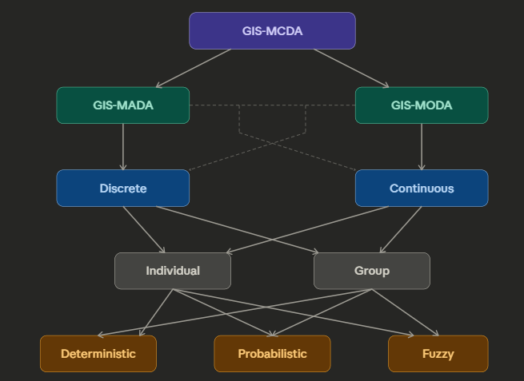
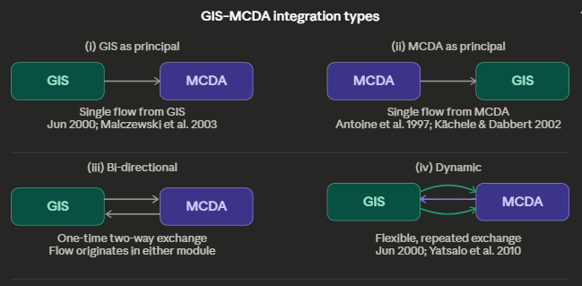

- Types:
	- Method:
		- Multi-attribute decision analysis (GIS-MADA)
		- Multi-objective decision analysis (GIS-MODA)
	- Data:
		- Continuous (more with MODA)
		- Discrete (more with MADA)
	- Decision Makers:
		- Group
		- Discrete
	- Problem
		- deterministic (full certainty) (majority)
		- probabilistic (uncertainty associated with limited information about the decision situation)
		- fuzzy (uncertainty associated with fuzziness (imprecision) concerning the description of the semantic meaning of the events, phenomena or statements themselves)
	- 
		- (https://claude.ai/share/c32ad292-1eb5-4318-a950-587b5fd5b2fb)
- MADA vs MODA:
	- **MADA** (Multi-Attribute): choose among a **finite, discrete set of alternatives** — each alternative is already defined and evaluated on a set of criteria → *which existing option is best?*
		- e.g. rank 5 candidate sites for a facility
		- Methods: WLC, AHP, TOPSIS, ELECTRE, PROMETHEE → see [[GIS-MADA]]
	- **MODA** (Multi-Objective): find the **optimal solution from a continuous decision space** — alternatives are not pre-defined but generated by satisfying multiple competing objectives simultaneously → *what is the best possible design/allocation?*
		- e.g. optimise land use allocation across a region to maximise greenspace while minimising cost
		- Methods: non-inferior solution generation, compromise programming, interactive approaches, heuristics
	- | | MADA | MODA |
	  | --- | --- | --- |
	  | Alternatives | Finite, pre-defined | Infinite, generated |
	  | Data | Discrete | Continuous |
	  | Question | Which is best? | What is optimal? |
	  | Criteria role | Evaluate alternatives | Define objectives to optimise |
	  | Typical GIS use | Site selection, suitability ranking | Land use allocation, network design |
-
-
- Integration: 
  
	- https://claude.ai/share/03810bbc-8615-401f-9e6e-040c97eed59d
-
-
- [[R: malczewskiMulticriteriaDecisionAnalysis2015]]
-