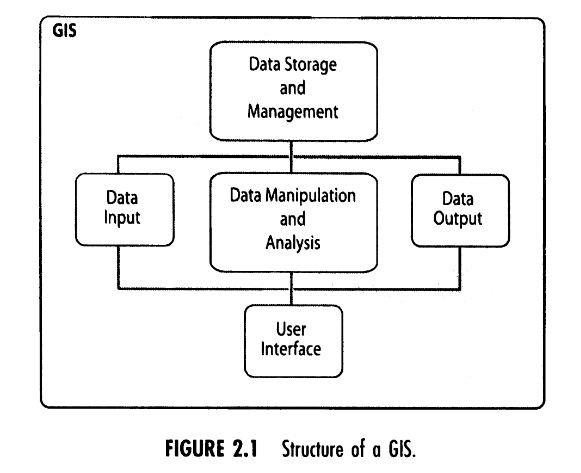
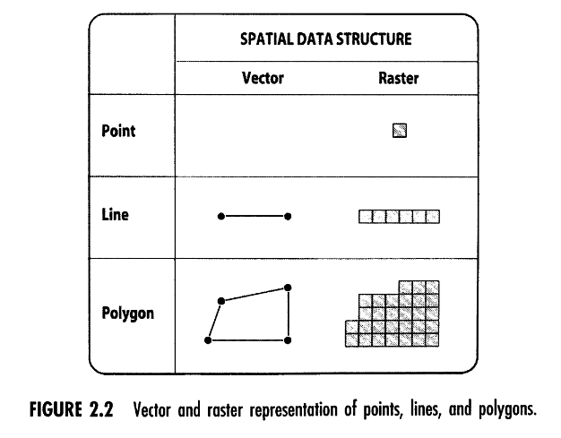
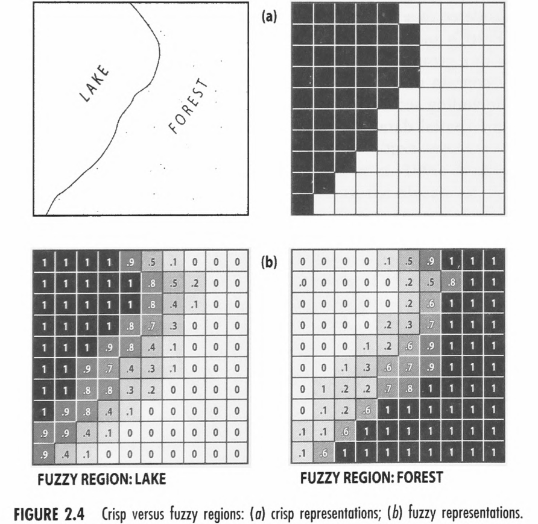

tags:: GIS

- helps in decision process for: **intelligence, design and choice**
- as a **decision support system** involving the integration of spatially referenced data in a problem solving environment
-
- 
- Aspects of Data Inputs:
	- Digitizing
	- Scanning
	- Remote sensing
	- GPS
	- Internet
	- Data sharing and interchange
	- Data qualitiy
- Aspects of Data Outpus:
	- Text Outputs
	- Graphic outputs
	- Digital data
	- other
- Vectors vs. Raster data:
- 
- locational data = describes the geographical space
- attribute data = describes other properties of the object
-
- The Object Concept = the world is made up of distinct, bounded *things*. Think of a building, a road, or a land parcel. They have clear edges and you can point to where one ends and another begins.
- The Field Concept = the world is made up of continuously varying values across space. Think of temperature, elevation, or soil moisture. There's no hard edge — it just gradually changes from one place to the next.
- Four levels of how we move from thinking about the real world to actually storing it in a GIS:
	- Conceptual — how do you *think* about the world? Distinct things, or gradual variation?
	- Data model— how do you *represent* that idea? If things have clear boundaries (like roads), you model them as discrete objects. If they blur into each other (like soil types), you model them as continuous fields.
	- Database model — how do you *store* it technically? Objects get stored as points, lines, and polygons. Fields get stored as grids, mathematical surfaces, or triangulated networks (TINs).
	- Graphic model — how do you *draw* it? Interestingly, both approaches can use either raster (pixel grid) or vector (shapes) formats.
- Crisp vs Fuzzy
- 
  id:: 69ce306f-af67-4b2b-be05-8bbbfbdfcbe0
- Layers vs Object Oriented
- Fundamental Functions: measurement, (re)classification, scalar and overlay operations. and neighborhood and connectivity operations
- Advanced Functions: statistical modeling and mathematical modeling functions
-