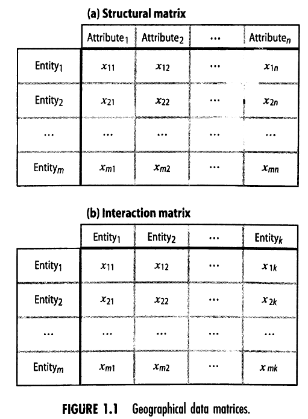

tags:: Spatial Planning

-
- Geographical matrices:
	- structure data matrix / geographical data matrix
		- geographical entity is mapped to attributes, and attributes can very for different entities
	- spatial interaction data matrix/ spatial behavior data matrix
		- either measured or assessed levels of interaction between the two entities. They can also be expressed in terms of distance, time, cost of getting from i to I, or the degree of connectivity between the two entities.
			- tial interaction
		- (1) What is the volume originating at each node (sum of a row or origin)?; (2) what is the volume terminated at each destination (sum of a column)?; and (3) what is the allocation of the flow column from origins to destinations (the individual cell totals in the matrix) ?
-
	- {:height 250, :width 222}
-
-
Levels of Measurement
| **Measurement** | **Characteristic** | **Valid Operations** |
|---|---|---|
| Nominal | Classification into a taxonomy where the ordering of class values is arbitrary | Equal |
| Ordinal | Relative ordering made with unknown or unequal intervals between classes | Less than, greater than |
| Interval | Continuous measurement using equal intervals made from an arbitrary zero point | Addition, subtraction, scaling by a constant |
| Ratio | Continuous measurement using equal intervals made relative to an absolute value of zero | Multiplication, division |

- Data must be transformed into Information
- Hard information = objective data
- Soft information = subjective data
- uncertainty does exists
- qualitative vs quantitative information