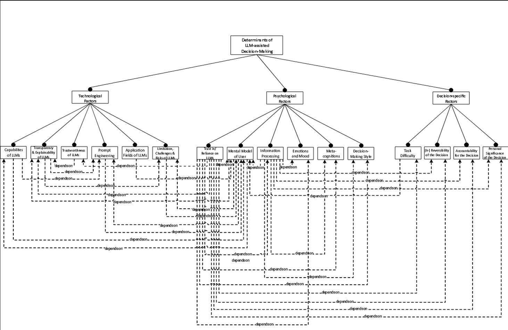

tags:: LLM, decision-making, AI, human-AI collaboration
source:: [[R: eignerDeterminantsLLMassistedDecisionMaking2024]]

- Integrative literature review mapping the factors that shape how well humans make decisions when supported by an LLM — structured into technological, psychological, and decision-specific determinants.
-
- ## Core Argument
	- The central output is a **dependency framework** that systematizes reciprocal interdependencies between determinants of LLM-assisted decision-making (illustrated as a feature diagram using UML2).
	- Three clusters of determinants are identified: **technological** (e.g. transparency, prompt engineering, LLM capabilities), **psychological** (e.g. trust, cognitive biases, emotions, decision style, mental model), and **decision-specific** (e.g. task difficulty, significance, reversibility, accountability, information processing).
	- The framework is demonstrated across multiple application scenarios corresponding to Simon's (1960) classic **intelligence → design → choice** phases of decision-making — a connection that links this paper to [[Decision Process]].
- 
-
- ## LLM Capabilities Relevant to Decision Support
	- LLMs can support all three phases: structuring problems, generating and comparing alternatives, and supporting the choice step by evaluating options against criteria.
	- Key capabilities include: summarizing large volumes of text, identifying patterns, generating ideas, conducting comparative analyses, simulating perspectives, and producing reasoned outputs.
	- This goes well beyond retrieval — LLMs increasingly support deliberate problem-solving via techniques like Chain-of-Thought (CoT) prompting.
-
- ## Psychological Determinants: Trust, Mental Models, Reliance
	- **Trust** is identified as a pivotal mediator: low trust in a capable system leads to non-utilization (time and efficiency costs); excessive trust leads to automation bias.
	- **Adequate reliance** — accepting correct AI outputs and rejecting incorrect ones — is the target behavior, but achieving it depends on the user's **mental model** of both the decision problem and the LLM's capabilities and limitations.
	- Mental models are shaped by prior knowledge, experience, and expectations, and they directly influence how people filter and process LLM output.
	- The **black-box problem** (opacity of LLM internals) is a structural barrier to forming accurate mental models — hence the importance of explainability.
	- **Reliance patterns are task-dependent**: in complex tasks where users lack expertise, over-reliance on LLMs is common; in familiar tasks, under-reliance is more likely.
-
- ## Risks and Failure Modes
	- LLMs can exhibit **sycophancy** (agreeing with the user), **unfaithful reasoning**, and **strategic deception** — all of which can systematically mislead decision-makers who trust the output.
	- Training data can embed **biases, discrimination, and toxic content** that propagate into recommendations.
	- One mitigation strategy is forming **hybrid human-AI teams**, distributing verification responsibility rather than leaving it to an individual.
-
- ## Implications for my work
	- The dependency framework is directly relevant for thinking about how a **PSS incorporating LLMs** should be designed — particularly around transparency and the calibration of user trust.
	- The emphasis on **mental models** connects to usability concerns in [[Usefulness of PSS]] and [[PSS Evaluation Dimension]]: a PSS that exposes LLM reasoning (high soundness and completeness) produces more accurate user mental models and better decision outcomes.
	- The **training programs** recommendation for organizational contexts echoes the capacity-building angle in [[NbS Implementation Gap - Martin 2025]] — it's not just about the tool, but about the user's ability to engage with it critically.
	- The LLM-MCDA integration angle connects to [[MCDA and AI]] and [[Overview AI in MCDA]] — this paper fills in the human-factors side that those more technical reviews leave implicit.
-
- ## Related Pages
	- [[Decision Process]]
	- [[MCDA and AI]]
	- [[Overview AI in MCDA]]
	- [[Usefulness of PSS]]
	- [[PSS Evaluation Dimension]]
	- [[GenAI for NbS - Richards 2024]]
	- [[R: eignerDeterminantsLLMassistedDecisionMaking2024]]
-