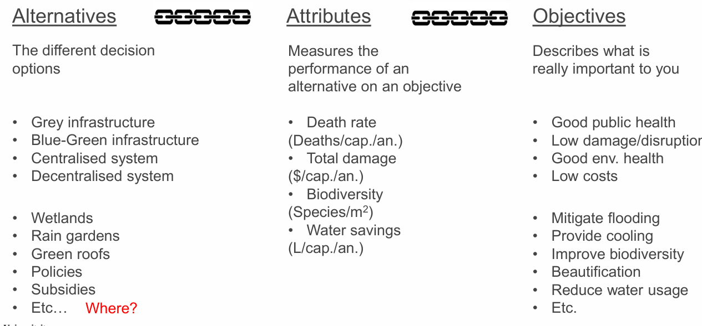
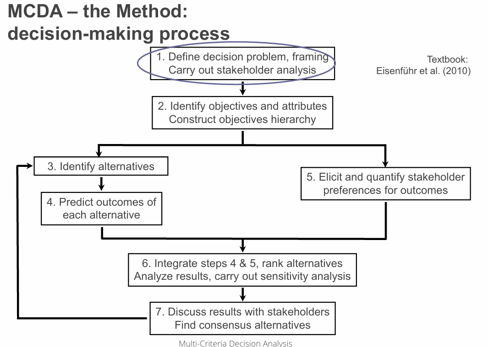

tags:: MCDA

- MCDA Definition
	- decision analysis is a formalization of common sense for 
	  decision problems which are too complex for informal use 
	  of common sense.
	- not about the decision, but the process! **Can't make the decision for us!**
- What is a good decision?
- **Start** with the **objectives** and not with the alternatives!
- 
- 
- 
- 
- ## Ideas PHD:
	- use bayesian statistics to find independ objectives?
	- exclude bias in weighting in step 5 (martijn)
	- find a better way of combing/aggregating the weighted values (gamma function)