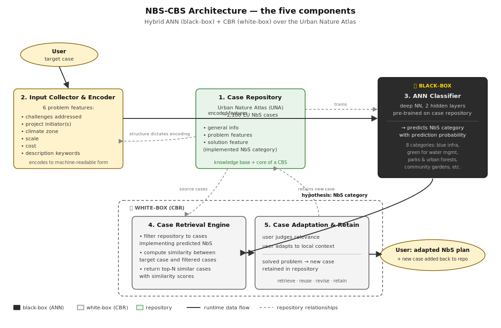
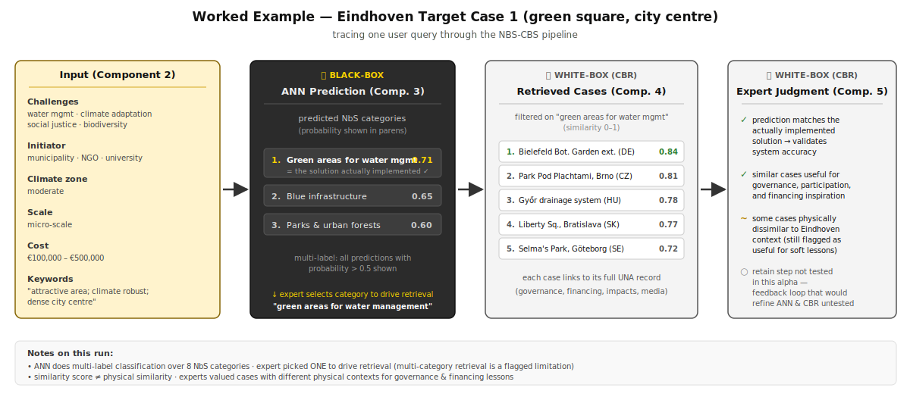

tags:: PSS, NbS, AI, Case-Based Reasoning
source:: [[R: sarabiNatureBasedSolutionsCaseBased2022]]

- The NBS-CBS is a hybrid expert system that couples a **black-box ANN classifier** with a **white-box case-based reasoning (CBR) engine** over the Urban Nature Atlas, so planners can extract usable lessons from a 1,100+ case NbS experience repository rather than drowning in it.
-
- ## Core Argument
	- NbS planning is **knowledge-heavy, multi-domain, and uncertain** — biophysical, social, institutional, and economic factors all matter, and the knowledge is scattered across stakeholders and rarely codified cleanly.
	- Existing **rule-based planning support systems** fail at this: they're rigid, opaque to stakeholders, hard to operate, and lack a mechanism to systematically absorb lessons from new cases.
	- Existing **experience repositories** (Oppla, Urban Nature Atlas) hold huge amounts of structured and unstructured case data but their **knowledge-transfer capacity is weak** — the information is there, but finding what's relevant for a specific target context is the bottleneck.
	- The proposed answer: an **expert system that applies machine learning to a case repository** — using ML's pattern-finding to generate hypotheses, and CBR's analogical reasoning to retrieve and adapt concrete past cases.
	- The system is explicitly positioned as **inspirational, not prescriptive** — it supports human judgment rather than replacing it.
-
- ## Black-Box vs White-Box: Why Both
	- **Black-box models (ANN)** — hard to explain, but good at finding hidden patterns in data and generating predictions with high accuracy. Their black-box nature is a trust problem in stakeholder-driven planning: users don't accept recommendations they can't see the reasoning behind.
	- **White-box models (CBR)** — easy to understand, provide a good accuracy/explainability trade-off, and work by analogy to prior experience. This matches how humans actually reason about novel problems.
	- **The CBR four-R process**: *retrieve* the most similar cases; *reuse* the case(s) to solve the target problem; *revise* if needed; *retain* the new solved problem back into the case repository. Reuse and revise often collapse into a single **adaptation** step.
	- **Complementarity is the whole point**: ANN handles numeric data and generalisation; CBR handles symbolic knowledge and can operate on limited data without generalising. CBR alone is sensitive to noise and struggles with large case bases; ANN alone can't explain itself. Together, the ANN generates a hypothesis that **narrows the CBR search space**, and the CBR provides the **explanatory surface** that makes the recommendation trustworthy.
	- This is a direct application of the **ANN-CBR twin-system** paradigm from the broader AI literature (Keane & Kenny 2019; Malek 2001; Leake et al. 2021) that hadn't yet been applied to NbS planning.
-
- ## System Architecture (the five components)
	- The NBS-CBS framework has five main components; the user's input flows left-to-right through the pipeline, with the case repository feeding both the trained classifier and the retrieval engine.
	-
	- {:height 717, :width 1200}
	-
	- Solid arrows = runtime data flow for a user query. Dashed arrows = the repository's role as training data, encoding schema, retrieval source, and target of the retain step.
-
- ## Worked Example: Eindhoven Target Case 1
	- A concrete trace of the architecture using the Eindhoven alpha-test (already-implemented green square near the city centre with drainage/storage — the test was against a known-good solution).
	-
	- {:height 503, :width 1162}
	-
	- What this run demonstrates:
		- The ANN is doing **multi-label classification over 8 NbS categories**, returning all with probability > 0.5 — so the user sees a ranked shortlist, not a single answer.
		- Experts picked **one category** ("green areas for water mgmt") to drive the retrieval — the system currently doesn't allow multi-category retrieval, a flagged limitation.
		- Similarity scores are **normalised 0–1** and do *not* have to mean physical similarity — experts found cases with different physical contexts still valuable for **governance, participation, and financing lessons**.
		- The retain step was explicitly **out of scope for the alpha test** — so the feedback loop that would improve the classifier and CBR over time hasn't been stress-tested yet.
-
- ## Expert Workshop Findings
	- Seven experts (5 from Eindhoven municipality — water, climate adaptation, planning — plus 2 from TU/e) tested the system on two target cases. Alpha-test format (designer-guided, feedback recorded).
	- **Accuracy**: on the case with a known implemented solution, the ANN's top recommendation *matched* the actual solution. On the future-case scenario, recommendations aligned with expert intuition.
	- **Process reframing**: experts found the inverted workflow genuinely novel — they would normally search for similar cases first and then look at solutions; the NBS-CBS flips this by recommending a solution category first, then using it to **guide** the case search. They assessed this as more efficient.
	- **Usability for non-experts**: one expert explicitly flagged value for **NGOs and citizen groups** — lowers the knowledge threshold to participate in NbS discussions, supports collaboration and confidence.
	- **Inspiration, not prescription**: experts valued the system for surfacing **governance set-ups, participatory approaches, and financing mechanisms** from similar cases, not just the physical NbS themselves — extending the system's utility beyond solution selection into the softer planning dimensions.
	- **Main requested extension**: allow **multi-category selection** for case retrieval — in practice, real sites often implement several NbS types together.
-
- ## Limitations
	- **Feature set is constrained by the repository** — only six problem features (challenges, initiator, climate zone, scale, cost, keywords) because that's what UNA exposes. Physical site characteristics, soil, hydrology, etc. are not in the model.
	- **No place-specific conditions** — the system does not reason about the physical feasibility of a NbS at a given site. The authors explicitly suggest coupling with [[NBS-PSS Playground - Sarabi 2022]] to fill this gap (that system does the site-suitability analysis this one skips).
	- **Single-category retrieval** — users can only filter on one predicted NbS category at a time.
	- **Expert knowledge still required** — assessing the relevance of retrieved cases needs someone who knows the local context well. The alpha test only involved experts; whether non-experts can use the system productively is an open question (flagged for a future beta test).
	- **ANN model is a basic DNN** (2 hidden layers) — the authors acknowledge architecture optimisation and alternative text-vectorisation methods are obvious next steps.
	- **Impact-assessment extension would need data that doesn't yet exist** — one of the most-wanted add-ons (recommending not just NbS types but their likely impacts) is blocked by the absence of impact data per case.
-
- ## Implications for My Work
	- This is the **explicit complement** to [[NBS-PSS Playground - Sarabi 2022]]: NBS-PSS does **site-suitability and solution prioritisation** with spatial MCDA; NBS-CBS does **experience-based solution inspiration** with ANN+CBR. The authors themselves frame them as couplable. A unified PSS-for-NbS agenda would integrate both: *where* and *which* (PSS) with *what have others done, and how* (CBS).
	- The **ANN-CBR twin architecture** is a pattern worth flagging for my own AI+MCDA work. It's directly related to the **bidirectional integration paradigm** noted in [[MCDA and AI]]: ML enhances structured decision logic (narrowing the search space), and the structured layer provides explainability that black-box ML lacks. CBR functions here as a **white-box retrieval and justification layer** over an opaque classifier — the same role MCDA can play in other contexts.
	- The **retrieve–reuse–revise–retain** loop is an interesting design primitive. The "retain" step is where the system's knowledge base grows — but it's also where quality control matters most. In my own reading this is under-developed in the NBS-CBS and is an interesting place to push: *who* decides what gets retained, and does that introduce bias?
	- The observation that **similar cases are useful beyond the physical solution** — for governance, participation, and financing — connects to [[Best practice of Governance tools]] and [[Barriers to Blue-Green Infrastructure Implementation]]. A NbS recommender is arguably more valuable as a *governance* recommender than a *technology* recommender, because governance is where the real uptake barriers sit ([[Limits of NbS]]).
	- The **dependency on UNA's feature schema** is a recurring lesson across NbS PSS work: the quality of the recommendation ceiling is set by the quality and breadth of the case-level metadata. This is an argument for pushing on **richer case documentation standards**, not just better models.
-
- ## Related Pages
	- [[NBS-PSS Playground - Sarabi 2022]]
	- [[Nature-based Solutions]]
	- [[Categories of NbS]]
	- [[A typology of NbS applications]]
	- [[PSS for NbS Claude Review]]
	- [[MCDA and AI]]
	- [[Overview AI in MCDA]]
	- [[Usage of AI]]
	- [[Barriers to Blue-Green Infrastructure Implementation]]
	- [[Limits of NbS]]
	- [[Best practice of Governance tools]]
	- [[R: sarabiNatureBasedSolutionsCaseBased2022]]
-