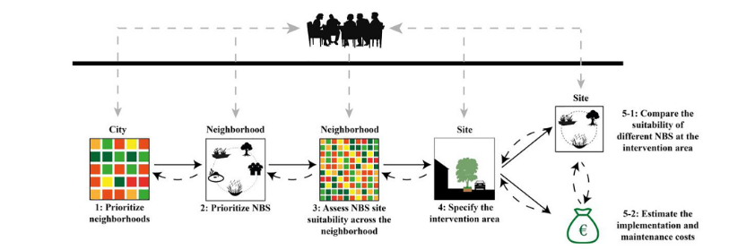
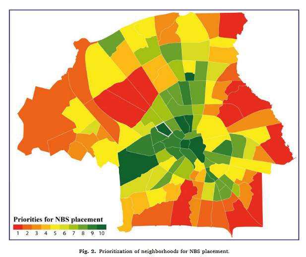

tags:: PSS, NbS, MCDA, Spatial Planning
source:: [[R: sarabiNaturebasedSolutionsPlanning2022]]

- The NBS-PSS is a multiscale, collaborative planning support system that integrates site prioritization and solution selection into a single hierarchical framework — bridging the gap between NbS multifunctionality and the sectoral realities of urban planning.
-
- ## Core Argument
	- Cities face mounting urban challenges (heat stress, flooding, pollution, social equity) for which **NbS** offer multifunctional solutions — but realizing that multifunctionality demands a **holistic and collaborative planning approach** across scales and disciplines.
	- Current PSS for NbS tend to be highly specialized, focusing on a single ecosystem service and scale; they are **not aligned with the mainstream sectoral planning process** in cities, with siloed departments and limited NbS knowledge as key barriers.
	- The **NBS-PSS** responds by automating and integrating the chain of multicriteria decisions needed to identify suitable intervention areas and NbS — a process that would otherwise be highly time-consuming and fragmented.
	- The system is explicitly NOT a replacement for human judgment; it is a **"playground"** — a space for stakeholders to test preferences, iterate over planning stages, and build shared understanding.
-
- ## System Design: Multiscale Hierarchical Framework (Ch. 2 & 3)
	- 
	- The NBS-PSS operates at two nested scales: **city/neighborhood scale** (steps 1–2) and **site/solution scale** (steps 3–5), with stakeholders interacting at each step.
	- ### Step 1 — Neighborhood Prioritization
		- {:height 286, :width 270}
		- Neighborhoods are ranked using a **spatial multicriteria evaluation (MCE)** framework that incorporates stakeholder-weighted challenges (e.g. heat stress, flooding, air pollution).
		- **Challenge maps** are developed by collecting spatial indicator data for each challenge. Indicators are flexible — different datasets can be used depending on city-specific data availability; most data used by Sarabi et al. came from European, national, or municipal open databases.
		- Exposure/vulnerability scores are combined via **Weighted Linear Combination (WLC)**. Weights are set using the **Delphi method** to reach consensus among stakeholders; pair-wise comparison is also an option but must be calculated outside the tool.
		- Key design principle: not all challenges have equal importance across cities or stakeholder groups — the system provides explicit **weighting flexibility** for this reason.
	- ### Step 2 — NbS Selection per Neighborhood
		- Based on the prioritization map, a set of NbS is proposed for the highest-priority neighborhoods.
		- Different NbS address different challenges with different intensities — e.g. rain gardens excel at stormwater management but have limited impact on heat stress compared to trees. This **differential effectiveness** drives the selection logic.
		- The system guides stakeholders toward solutions that best match the challenge profile of the selected neighborhood.
	- ### Step 3 — Site Suitability Assessment
		- Within the selected neighborhood, the system assesses **site-level suitability** for each proposed NbS.
		- Three maps are generated: **opportunity map**, **challenge map**, and a **suitability map** derived from combining these.
		- The process involves: (a) **masking** locations where the NbS is physically infeasible, (b) **value scaling** of indicators, and (c) **stakeholder weighting** of opportunity and challenge criteria.
		- Feasibility is assessed by examining planning/policy-related and physical requirements (slope, groundwater distance, ownership, land use/function).
		- Crucially, a high-suitability site does not automatically mean the NbS is the best fit — Step 5 enables comparison across competing solutions at the same location.
	- ### Step 4 — Intervention Area Specification
		- Stakeholders draw **intervention areas** by overlapping the suitability map with aerial imagery of the site.
		- This is the step where local expert knowledge is most directly integrated — ground-truthing the spatial outputs with contextual judgment.
	- ### Step 5 — Implementation and Maintenance Cost Estimation
		- For each NbS in the intervention area, the system calculates a **suitability score** (sum of opportunity and challenge scores) and estimates **implementation and maintenance costs**.
		- Cost values are drawn from published sources but are **user-modifiable**, acknowledging significant variation across municipalities and local conditions.
		- The cost-suitability comparison is the primary tool for final solution selection — providing a structured basis for trade-off reasoning.
-
- ## Eindhoven Case Study
	- Eindhoven was selected as a test case partly because two critical barriers to NbS adoption are well-documented there: **sectoral and informational silos** between municipal departments, and **limited staff knowledge and experience** with NbS — making it a realistic stress test.
	- The system was applied with a group of municipal experts. The outcome validated two key properties: (1) **rapid results** — fast enough to support real-time deliberation in a workshop setting; (2) **easy-to-understand outputs** — accessible to participants without deep GIS expertise (only basic GIS knowledge, typical in any municipality, was required).
	- For a selected street (tree plantation case), the suitability analysis confirmed the intuitive choice — the highest-scoring NbS also had relatively low implementation costs and only marginally higher maintenance costs than alternatives. For the green roof case, the **intensive green roof** scored higher in suitability than the extensive variant despite a larger cost gap — surfacing a real trade-off for stakeholders to deliberate.
	- Participants noted the tool motivates cross-departmental engagement: it allows colleagues not normally involved in planning sessions to express needs and see how their preferences affect plans — a direct counter to the silo barrier.
	- The system was found to **enhance awareness** of NbS opportunities in urban areas — a non-trivial outcome given the knowledge barrier at Eindhoven.
-
- ## Validity, Usability, and Limitations
	- The system attempts to **balance validity and usability**: multiple criteria across two scales provide analytical rigor, while the hierarchical process keeps cognitive load manageable for non-specialists.
	- **Data availability** is the primary structural constraint. Steps 1–2 are relatively robust even with lower-resolution data; steps 3–5 require finer spatial data, but local expert knowledge can partially compensate through intervention area drawing and parameter adjustment.
	- A notable limitation: the current version does not account for **synergies and trade-offs between ecosystem services** — different ecosystem services affect each other non-linearly, and future versions should integrate this.
	- Combining NBS-PSS with **hydrological simulation tools** (e.g. for flow path identification) is flagged as a high-value integration that would improve placement decisions.
	- The system is designed as a **"playground"** — users can test strategic roadmaps for NbS by iterating across steps, not just running a linear pipeline once.
-
- ## Implications for My Work
	- The NBS-PSS is the closest existing system to what a [[PSS for NbS]] research agenda would aim to build — it is the direct predecessor any new system must relate to.
	- The **multiscale hierarchical structure** (city → neighborhood → site → solution) is the right architectural logic; it mirrors the zoom levels discussed in [[Zoom levels]] and the spatial planning hierarchy in [[Introduction to Spatial Planning]].
	- The **stakeholder weighting** via Delphi and WLC connects directly to [[MCDA Elements]] and [[GIS-MCDA Overview]] — the NBS-PSS is essentially a structured [[GIS-MADA]] application.
	- The explicit acknowledgment of the **silo barrier** and the framing of the tool as a facilitator of cross-departmental dialogue aligns with [[Barriers to Blue-Green Infrastructure Implementation]] and echoes findings from [[PSS for NbS Claude Review]].
	- Key gap to address: **synergies and trade-offs between ecosystem services** — this is where [[Trade-offs in urban NbS - Stijnen 2024]] is directly relevant, and where future PSS work (including mine) should go.
	- The tool's cost estimation module (step 5-2) is a practical response to the **implementation-maintenance cost gap** that planners care about — see also [[Economic Benefits of Blue-Green Infrastructure]].
-
- ## Related Pages
	- [[Nature-based Solutions]]
	- [[NBS and Climate Change]]
	- [[PSS for NbS Claude Review]]
	- [[Usefulness of PSS]]
	- [[GIS-MCDA Overview]]
	- [[MCDA Elements]]
	- [[Barriers to Blue-Green Infrastructure Implementation]]
	- [[Trade-offs in urban NbS - Stijnen 2024]]
	- [[Zoom levels]]
	- [[R: sarabiNaturebasedSolutionsPlanning2022]]
-