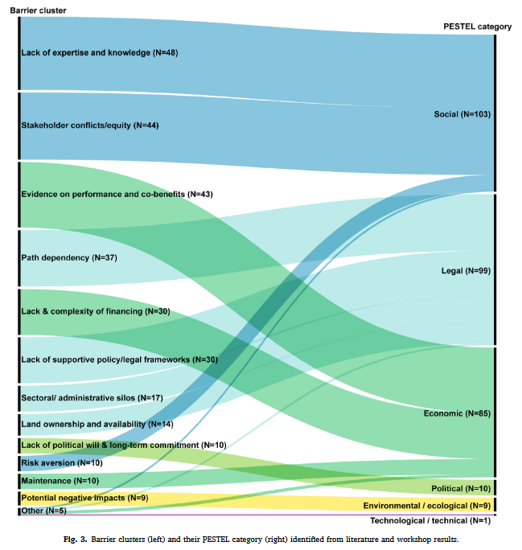

tags:: NbS, Governance, Barriers, Enablers, Policy
source:: [[R: martinNaturebasedSolutionImplementation2025]]

- Systematic review of 307 barriers and 301 enablers to NbS implementation, drawn from grey and peer-reviewed literature plus 34 expert workshops. Organised using a PESTEL framework (Political, Economic, Social, Technological, Environmental, Legal). Core finding: the same factors — stakeholder engagement, evidence base, expertise, and funding — operate as both barriers and enablers depending on context.
- 
- ## The Implementation Gap
	- Despite growing political traction (Kunming-Montreal Biodiversity Framework, EU strategies), **NbS implementation remains fragmented and context-specific**, preventing upscaling and mainstreaming — the so-called "NbS implementation gap."
	- The gap is not primarily technical; it is **governance-driven**: institutional, legal, regulatory, social and economic factors dominate both the barrier and enabler clusters.
-
- ## Top Barrier Clusters
	- The largest barrier cluster is **lack of expertise and knowledge** across all NbS implementation stages (design, construction, monitoring, maintenance), compounded by limited technical standards and guidance products.
	- **Lack of evidence on NbS performance and co-benefits** is nearly equally prominent — both the absence of robust consistent data and the difficulty of translating ecosystem service evidence into formats decision-makers can act on.
	- **Equity issues, stakeholder engagement, and conflicts** represent a major cluster: inclusive and just stakeholder engagement has proven a decisive factor, but achieving it at scale is structurally difficult.
	- **Sectoral and administrative silos** are a particularly salient barrier for NbS, which by nature cut across planning departments, environmental agencies, and engineering units simultaneously.
	- **Path dependency** — the tendency to remain locked into grey infrastructure solutions — is singled out as a fundamental systemic barrier. Grey-measure path dependency means decision-makers default to familiar solutions even when NbS alternatives exist; see also [[Limits of NbS]] for the institutional analysis of this mechanism.
	- **Risk aversion and scepticism** frequently stall NbS projects, often stemming from the same knowledge deficit that creates the expertise barrier.
	- **Lack of funding and high costs** are in the top five; most NbS rely on limited public funds, and the costs are front-loaded relative to the timeline of benefit delivery — a structural mismatch.
	- **Land ownership and availability** issues were cited as practical obstacles across both literature and workshops.
	- **Maintenance** emerged as its own cluster, reflecting that long-term upkeep is systematically under-resourced and under-planned.
	- Smaller clusters include NbS **disservices** (negative impacts that generate local opposition) and a broad **'other'** category of highly context-specific barriers.
	- Notably, **lack of political will and lack of supportive policies** were mentioned infrequently as standalone barriers — suggesting they tend to co-occur with the larger clusters above rather than operate independently.
-
- ## Top Enabler Clusters
	- **Polycentric and cross-sectoral governance** emerged as the most structurally important enabler: arrangements that distribute decision-making across scales (local, regional, national) and sectors help NbS navigate siloed institutions. The Isar Plan in Munich is the most-cited practical example. This connects directly to [[Barriers to Blue-Green Infrastructure Implementation]] on the need for coordinated planning across agencies.
	- **Expertise and knowledge** is the third largest enabler cluster — the mirror image of the top barrier. This encompasses NbS-specific training, standards development, and knowledge products that can be handed to practitioners.
	- **Evidence on performance and co-benefits** is a prevalent policy enabler, though it is noted that most evidence in the literature is *claimed* rather than empirically demonstrated at scale.
	- **Stakeholder engagement and equity** features prominently on both sides: inclusive co-design processes — including social inclusion, trustful stakeholder relationships, and community trust — are necessary conditions for NbS to gain legitimacy and get built. See [[NbS Planning Framework - Albert 2021]] on how equity is embedded as a core planning principle.
	- **Champions and advocates** emerged as a distinct enabler cluster with no corresponding barrier — forerunners and early adopters at different governance levels (local government, NGOs, national agencies) play an outsized role in getting NbS off the ground.
	- **Communication and awareness raising** is also a unique enabler: avoiding jargon, clearly communicating co-benefits in terms accessible to decision-makers, and managing the 'fear of the unknown' that many NbS projects encounter.
	- **Supportive policies and legal frameworks** are acknowledged as an enabler, but primarily as a *gap* — the literature describes what such frameworks should do rather than documenting working examples. NbS-specific policies and national action plans are largely absent in Europe.
	- **Funding, financial tools, and political will / long-term commitment** mirror their corresponding barriers: where they exist, they enable; where they are absent, they constrain.
	- **Adaptiveness** of governance systems is linked to polycentricity — the ability to retain flexibility in light of climate change and rapidly evolving societal challenges.
	- **Aesthetics** and a triggering **disaster event** were the least frequently cited enablers — the latter suggesting that crisis conditions can unlock political and financial barriers that prove otherwise immovable.
-
- ## The Homology of Barriers and Enablers
	- A structurally important finding: **most barriers and enablers are mirror images of each other**. The same dimensions — evidence base, expertise, stakeholder engagement, funding, political will — appear on both sides. This means there are no entirely novel enablers to discover; the leverage points are already known.
	- The policy implication is that **targeted investment in a small number of clusters** (expertise, evidence, stakeholder engagement, polycentric governance) could simultaneously address multiple barriers and activate multiple enablers.
-
- ## Analytical Framework: PESTEL
	- The paper applies the **PESTEL framework** (Aguilar, 1967) to categorise barriers and enablers across Political, Economic, Social, Technological/technical, Environmental/ecological, and Legal dimensions. This offers a structured overview of governance categories that could be reused in PSS design to ensure comprehensive coverage — see [[PSS for NbS Claude Review]].
-
- ## Implications for My Work
	- This paper is the **problem anchor** for arguments about coordination and stakeholder engagement barriers. The N = 307 / 301 systematic evidence base means the existence of these barriers does not need to be re-argued — only cited.
	- The **polycentric governance enabler** is the most tractable structural finding: it points toward multi-actor, multi-scale coordination tools as a design target — directly relevant to a PSS framing.
	- The **PESTEL taxonomy** could structure a literature chapter or a barrier/enabler assessment module in a decision-support tool.
	- The gap between claimed and demonstrated evidence (especially for legal frameworks and co-benefits) is an honest acknowledgement of what the field still lacks — useful for scoping a research contribution.
-
- ## Related Pages
	- [[Nature-based Solutions]]
	- [[Limits of NbS]]
	- [[Barriers to Blue-Green Infrastructure Implementation]]
	- [[NbS Planning Framework - Albert 2021]]
	- [[PSS for NbS Claude Review]]
	- [[Toward an operational framework for NbS]]
	- [[Societal Challenges]]
	- [[R: martinNaturebasedSolutionImplementation2025]]
-