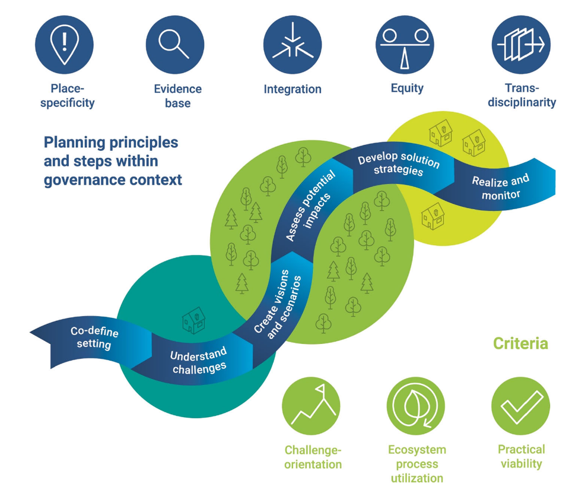

tags:: NbS, planning, framework, landscape planning
source:: [[R: albertPlanningNaturebasedSolutions2021]]

- Albert et al. (2021) propose a structured planning framework for NbS, grounded in a case study on the Lahn river (Germany), consisting of three interlocking components: NbS criteria, six planning steps, and five guiding principles.
-
- 
-
- ## What Makes Something an NbS
	- The framework rests on three defining criteria: **ecosystem process utilisation** (NbS must actively harness ecological processes and organism–environment linkages — not merely be inspired by nature), **challenge-orientation** (must address a well-defined societal challenge, e.g. water quality under the Water Framework Directive or climate adaptation), and **practical viability** (must be embedded in governance and business models that enable real-world implementation).
	- The authors are explicit that **co-benefits should be aspired to but not treated as defining criteria** — an NbS is not disqualified by having fewer co-benefits than a comparator.
	- **Cost-effectiveness cannot simply be stipulated** — it requires case-specific analysis, not assumed from general claims.
-
- ## Six Planning Steps
	- The framework identifies six steps, though in practice they are applied **iteratively rather than sequentially**:
		- **Co-define setting** — the kick-off step: clarifies the context, overarching societal challenges, aims, and process of the project. Developed with practice partners early, ideally during funding acquisition.
		- **Understand challenges** — assesses societal problem dimensions across spatial and temporal scales. Includes actors, networks, and problem perceptions. In the Lahn case, this used semi-structured interviews to understand stakeholder perspectives.
		- **Create visions and scenarios** — develops future-oriented framings against which NbS options can be evaluated.
		- **Assess potential impacts** — multidimensional evaluation of potential costs and benefits of existing or planned NbS, and of alternatives. In the Lahn case, InVEST-type modelling was applied to assess four ecosystem services under land use change.
		- **Develop solution strategies** — identifies and spatially localises NbS within the landscape; the core design step. Includes selecting NbS that address the most challenges and mapping opportunity spaces using GIS.
		- **Realize and monitor** — requires actionable solution strategies as part of the plan, and must address implementation barriers: inadequate finance and regulation, institutional fragmentation, uncertainty, and limited land and time availability.
	- The framework **resonates with but also differs from** established landscape planning cycles (assess → goal-set → design → implement → evaluate): it emphasises societal challenge orientation more strongly and treats governance aspects as structurally integral rather than contextual.
-
- ## Five Planning Principles
	- **Place-specificity** — both the societal challenges and the NbS responses are context-specific; no off-the-shelf solutions. Establishing NbS can also help shape a new sense of place.
	- **Evidence base** — planning should draw on the best available knowledge to infer reliable recommendations and actions. This means acknowledging that evidence on multi-dimensional NbS effectiveness is still incomplete.
	- **Integration** — considers thematically related approaches, temporal, spatial, and sectoral scales, and governance policies simultaneously. Integration across spatial scales is essential because NbS benefits and impacts are multi-directional.
	- **Equity** — understood along four dimensions: **recognition** (rights, values, interests of different actors), **procedure** (inclusive and effective participation), **distribution** (equal sharing of costs and benefits), and **context** (the pre-existing political, economic, and social conditions that shape who can act). Equity must be embedded both in the participation process and in the planning outputs.
	- **Transdisciplinarity** — systematic involvement of diverse knowledge holders (researchers across disciplines + non-academic participants) in co-designing and implementing the process; the goal is new knowledge and a common answer.
-
- ## Governance as a Structural Dimension
	- Governance is treated as an explicit embedding condition for the planning steps, not an afterthought. Suitable governance models range from bilateral agreements to community-based approaches.
	- Actor analysis is integral: in the Lahn case, a Social Network Analysis using the participatory **Net-Map** tool was used to detect important actor relations and understand the governance context.
	- **Small group deliberation with multi-criteria weighting** (different viewpoints, consensus on criteria performance) was used in the impact assessment step — a direct overlap with [[MCDA Elements]] and [[GIS-MCDA Overview]].
-
- ## Application Insights from the Lahn Case
	- The Lahn project aimed at improving the river's ecological health and connectivity under the Water Framework Directive while also enriching quality of life along its shores — a dual societal challenge framing.
	- The framework was developed within an EU-funded project (PlanSmart), collaborating with practice partners from the start.
	- Key methodological finding: the NBS term itself was **little known among German planning practitioners** and some stakeholders interpreted it as biased towards nature conservation — reinforcing the importance of the first principle (place-specific communication) and the framework's adaptive use of the term.
	- The authors flag a persistent tension between the need for definitional clarity in scientific discourse and the need for pragmatic action in practice — something any PSS for NbS must navigate.
-
- ## Implications for My Work
	- The six-step planning cycle maps closely onto the workflow assumptions underlying [[PSS for NbS Claude Review]] and the [[NBS-PSS Playground - Sarabi 2022]] tool — the Albert et al. framework offers a theoretically grounded process model to justify a PSS's structure.
	- The five principles — especially **equity** and **transdisciplinarity** — add normative depth to what a PSS should support beyond technical analysis: the tool needs to facilitate inclusive participation and cross-scale integration, not just produce optimal solutions.
	- The iterative (non-linear) nature of the steps is important for PSS design: tools that enforce a linear sequence will fail in practice. This connects to the "opportunistic rather than strategic" planning finding from [[Barriers to Blue-Green Infrastructure Implementation]].
	- The **multi-criteria group deliberation** in the impact assessment step is direct evidence for the value of MCDA-based approaches embedded in participatory processes — see [[MCDA Lecture]] and [[GIS-MCDA Overview]].
	- The governance emphasis aligns with [[Limits of NbS]] (Seddon 2020): both papers argue that institutional embeddedness is as critical as technical performance for NbS to work.
-
- ## Related Pages
	- [[Nature-based Solutions]]
	- [[NBS and Climate Change]]
	- [[Limits of NbS]]
	- [[Toward an operational framework for NbS]]
	- [[PSS for NbS Claude Review]]
	- [[MCDA Elements]]
	- [[GIS-MCDA Overview]]
	- [[Societal Challenges]]
	- [[Barriers to Blue-Green Infrastructure Implementation]]
	- [[R: albertPlanningNaturebasedSolutions2021]]
-