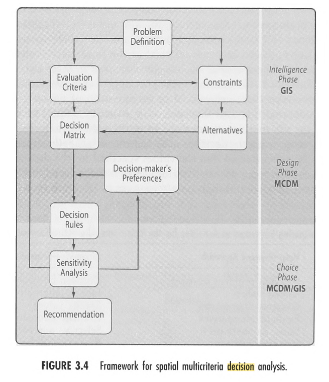

## Mappings:
	- Elements of MCDM [[R: malczewskiGISMulticriteriaDecision1999]] (Chapter 3)
		- a goal or a set of goals decision maker (interest group) attempts to achieve;
		- the decision maker or group of decision makers involved in the decision-making process along with their preferences with respect to evaluation criteria;
		- a set of evaluation criteria (objectives and/ or attributes) on the basis of which the decision makers evaluate alternative courses of action;
		- the set of decision alternatives, that is, the decision or action variables;
		- the set of uncontrollable variables or states o f nature (decision environment); and
		- the set of outcomes or consequences associated with each alternative-attribute pair
	- To Decision Elements (Chapter 2)
		- Intelligence Phase
		- Design Phase
		- Choice Phase
		- 
	-