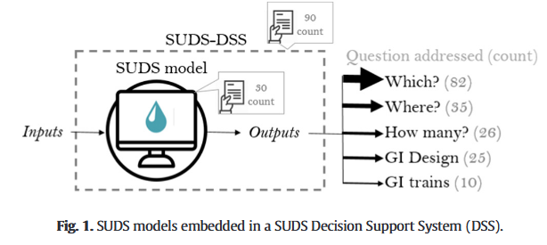
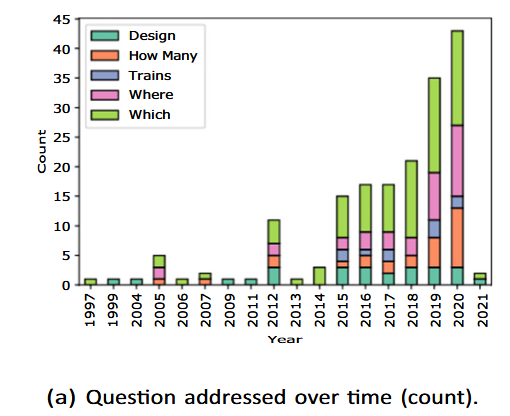
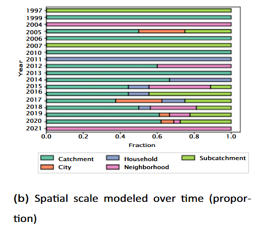
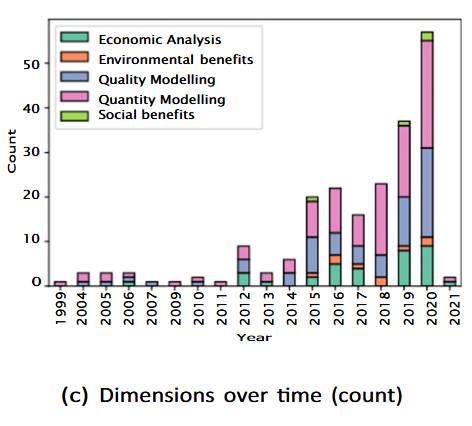
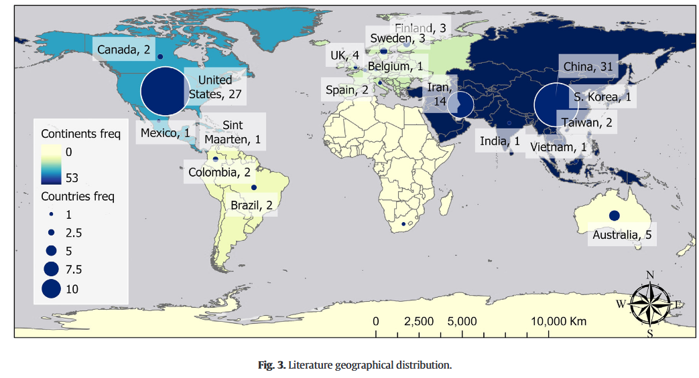
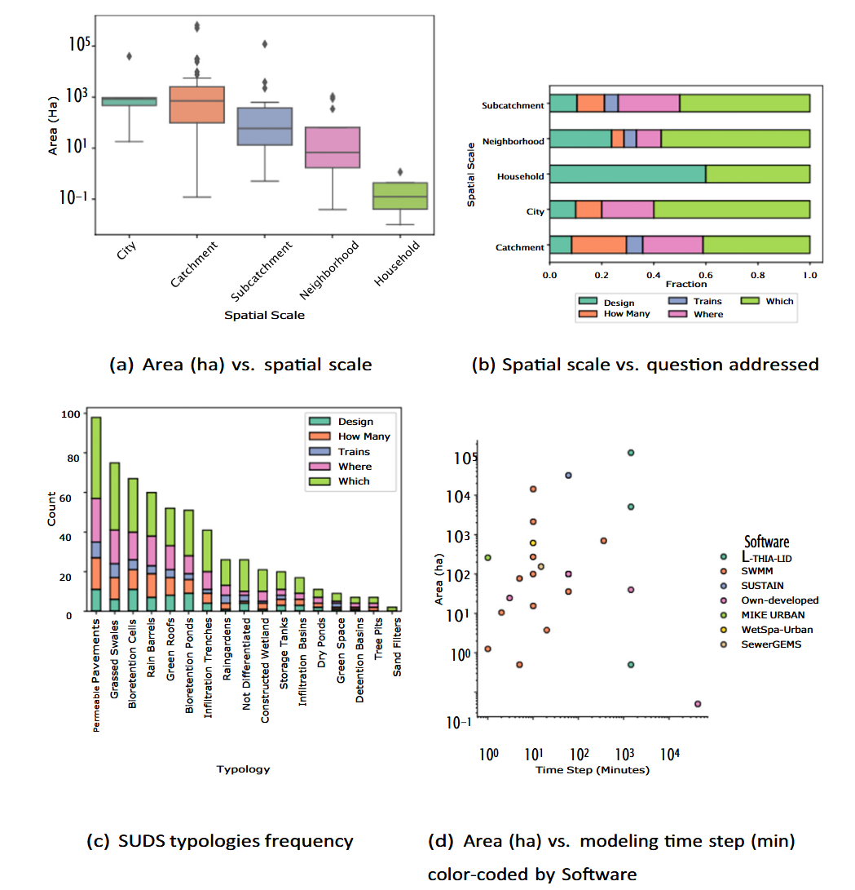
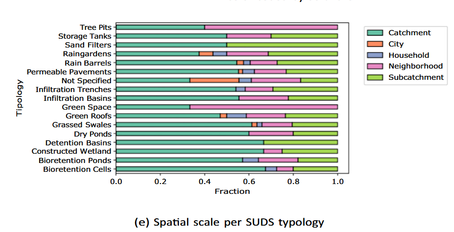
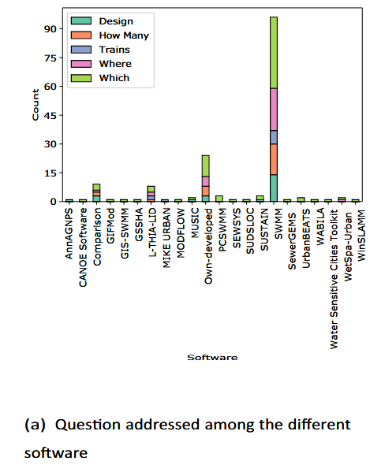
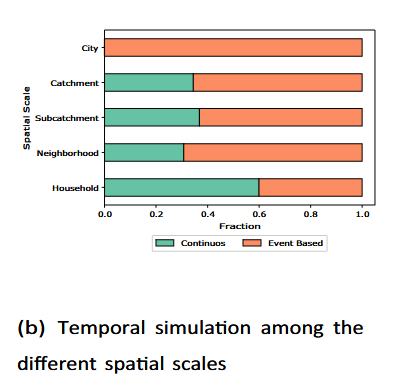
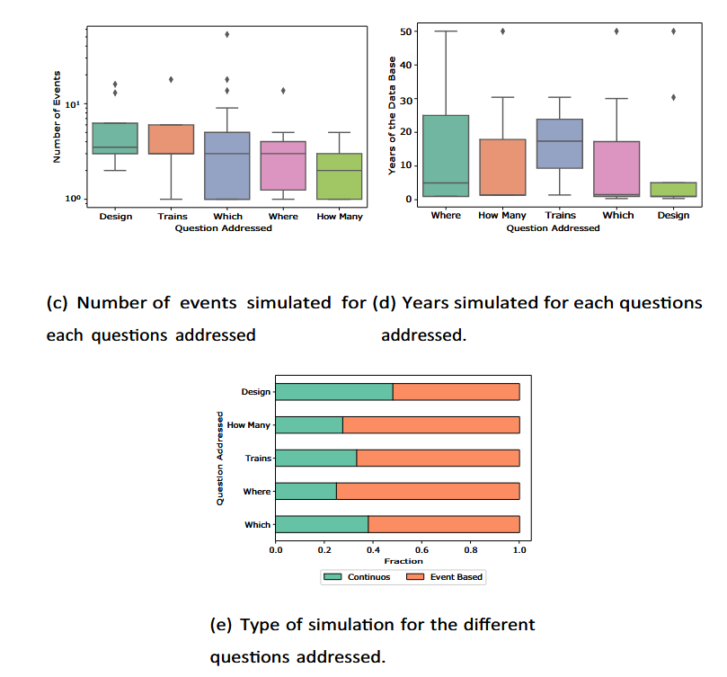

tags:: PSS, SUDS, DSS, WSUD

- | Set 1 | Set 2 | Set 3 | Set 4 |
  |---|---|---|---|
  | **Decision/tool keywords** | **SUDS keywords** | **Modeling keywords** | **Stormwater keywords** |
  | Assess* | Best management practice* (BMP) | Model* | Runoff |
  | Effective* | Sustainable urban drainage systems (SUDS) | – | Storm* |
  | Cost* | Green infrastructure (GI) | – | Urban |
  | Heuristic* | Low impact development (LID) | – | Flood* |
  | Management | Water sensitive urban design (WSUD) | – | Pluvial |
  | Optim* | Nature based solutions | – | Rainfall |
  | Objective* | Blue green systems | – | Planning |
  | Planning | Bioretention | – | – |
  | Support* | Infiltration | – | – |
  | Tool* | Retention | – | – |
  | Decision* | Detention | – | – |
	- Sets of keywords used for search. Papers whose title have at least three words in different keyword sets were considered for review
- 
	- count of papers
- 
- 
- 
- 
-
- 
- 
-
- ****
	- SWMM is an tool by the american goverment [[rossmanStormWaterManagement2010]]
	-
- 
	- Event based = model certain events
	- continuos model weeks/months/years...
- 
- | Dimension | Percentage (%) |
  |---|---|
  | Quantity modeling | 82 |
  | Quality modeling | 53 |
  | Economic analysis | 28 |
  | Environmental benefits | 8 |
  | Social benefits | 3 |
-
- | Process | Percentage (%) |
  |---|---|
  | Runoff quantity | 100 |
  | Runoff quality | 43 |
  | Cost analysis | 32 |
  | Infiltration | 27 |
  | Evaporation | 14 |
  | Groundwater flow | 6 |
  | Sedimentation | 2 |
  | Climate change scenarios | 0.1 |
- | Stakeholder | Percentage (%) |
  |---|---|
  | Not specified | 31 |
  | Local authorities | 31 |
  | Utilities | 13 |
  | Neighbors | 13 |
  | Politicians | 6 |
  | Environmental Agencies (EA) | 6 |
-
- [[ferransSustainableUrbanDrainage2022]]