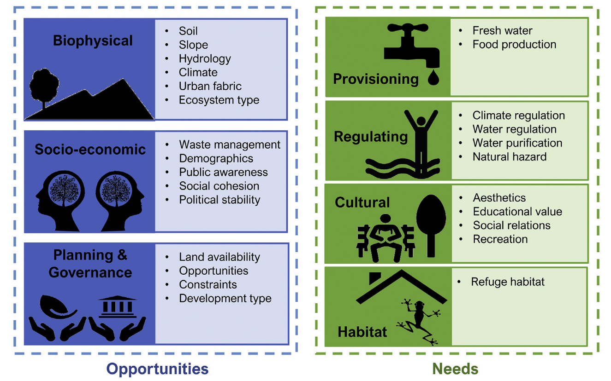
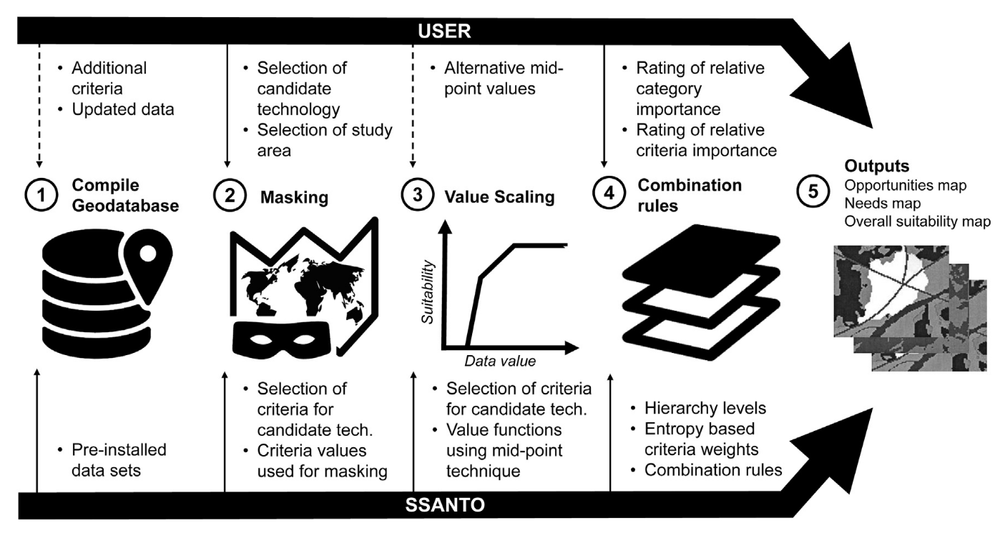

tags:: PSS, GIS-MCDA, WSUD, Blue Green Infrastructure
source:: [[R: kullerPlanningsupportToolSpatial2019]]

- SSANTO (Spatial Suitability ANalysis TOol) is a GIS-MCDA planning support system for mapping where in a city different WSUD assets are most suitable, combining both what a location *offers* and what it *needs*.
- ### Opportunities vs Needs
- 
-
- ## Core Argument
	- Urban WSUD planning has been largely **ad-hoc** — lacking systematic spatial strategy and producing sub-optimal outcomes. SSANTO is designed to address this by providing a rapid, rigorous suitability assessment tool that planners can actually use.
	- The central conceptual contribution is the **dual suitability framework**: suitability is framed from two complementary perspectives — **'Opportunities'** (biophysical, socio-economic, planning & governance factors that determine whether a location can *support* WSUD) and **'Needs'** (ecosystem services criteria that determine what a location *needs* from WSUD). This is SSANTO's main innovation over prior tools. See [[WSUD suitability Framework]].
	- The tool covers seven WSUD types: bioretention & rain gardens, infiltration systems, green roofs, ponds & lakes, swales, rainwater tanks, and constructed wetlands — assessed across the full spatial extent of an urban area simultaneously.
-
- ## SSANTO Workflow
	- The tool follows four steps (see the workflow figure in the paper):
		- 
		- **Step 1 — Geodatabase assembly**: all relevant spatial datasets are c
		- ompiled; each indicator from the suitability framework is represented as a spatial layer.
		- **Step 2 — Constraint masking**: areas where at least one hard constraint makes WSUD implementation impossible are removed from the analysis entirely.
		- **Step 3 — Value scaling**: raw data are converted into comparable suitability scores (0–1) via **value functions** that encode expert knowledge about the relationship between a raw indicator and suitability. Predefined value functions are built in, though user-defined scales are flagged as future work.
		- **Step 4 — Weighting and aggregation**: criteria are weighted via a **hierarchical weighting** approach (using the rating method), then aggregated using **Weighted Linear Combination (WLC)** to produce per-asset suitability maps. Because not all aspects carry the same importance, weighting is user-defined and must reflect planning priorities through **participatory processes with stakeholders**.
	- The output is a set of ready-to-use, interpretable suitability maps — one per WSUD type — that can directly inform planning conversations.
-
- ## GIS-MCDA Design Choices
	- **WLC** was chosen because, despite assuming linearity and additivity, it performs nearly as well as far more complex non-linear methods and is well understood. In a [[GIS-MCDA Overview]] context, this is a classic MADA approach — finite, pre-defined criteria scored spatially and weighted to produce ranked outputs.
	- The **rating method** for weight elicitation is simple but carries known biases; the paper acknowledges that pairwise comparison (e.g. AHP) is widely used but has been criticised for inflated weight spread and inconsistencies. SSANTO's flexible architecture allows for adding other weighting methods (e.g. SWING) in the future.
	- **Uncertainty and bias are unavoidable** in GIS-MCDA — the authors are explicit about this. The tool supports more robust decisions rather than replacing human judgement, and **suitability is ultimately a human concept, not an objectively measurable quantity**. Because weights reflect preferences and expertise, they have to come from the users, not the model.
-
- ## Validation and the Socio-Technical Modelling Challenge
	- Validation was done by comparing SSANTO outputs to a spatial prioritisation study carried out by Melbourne-based WSUD consultancy E2D for Darebin (2017). The tool performs well in mirroring the outcomes of human decision-making processes, though some discrepancies appeared.
	- Those discrepancies reinforce a key point: the tool **supports rather than replaces** planning and human judgement — see [[Usefulness of PSS]].
	- The paper identifies three validation strategies applicable to socio-technical models: (1) comparing outputs to established models (e.g. flood modelling); (2) comparing to historical data (e.g. scenario modelling); (3) qualitative expert/stakeholder evaluation through structured workshops.
	- The broader methodological challenge is the **lack of accepted ways to validate socio-technical models** — one of the greatest unsolved scientific challenges in the field. Models that represent human judgement and preferences cannot simply be validated like physical simulations. Modelling communities need to urgently engage with this question to find credible yet workable solutions.
-
- ## Data Quality and "Garbage In, Garbage Out"
	- SSANTO's outputs are only as good as its inputs — the classic GIGO principle applies. Data availability, resolution, and quality are critical constraints. This connects directly to the **data quality** usability dimension in [[Usefulness of PSS]].
	- The criteria span the planning & governance, provisioning, regulating, cultural, and habitat ecosystem service categories from the suitability framework.
-
- ## Implications for my work
	- SSANTO is one of the clearest examples of a PSS that explicitly integrates **Needs + Opportunities** into a single spatial framework — this dual framing is worth building on for any PSS that tries to go beyond purely biophysical suitability mapping.
	- The **validation challenge** is directly relevant to PSS design: if the model is meant to support human decision-making, what counts as evidence that it works? Expert workshops and comparison to consultant outputs are legitimate but under-theorised approaches. This connects to the credibility and reliability dimensions in [[Usefulness of PSS]].
	- The emphasis on **participatory weight elicitation** confirms that GIS-MCDA tools are never neutral — the weighting step is where stakeholder values enter the model, and this requires deliberate governance design. See also [[GI Spatial Planning and MCDA - Meerow 2017]] for a parallel argument.
	- **User-defined value scales** are flagged as a limitation — the current defaults may not be transferable across contexts (different cities, regulatory systems, or WSUD cultures). This is a significant caveat for applying SSANTO outside of Australia.
-
- ## Related Pages
	- [[GIS-MCDA Overview]]
	- [[WSUD suitability Framework]]
	- [[WSUD Planning Process]]
	- [[GI Spatial Planning and MCDA - Meerow 2017]]
	- [[Usefulness of PSS]]
	- [[Blue Green Infrastructure]]
	- [[Barriers to Blue-Green Infrastructure Implementation]]
	- [[R: kullerPlanningsupportToolSpatial2019]]
-