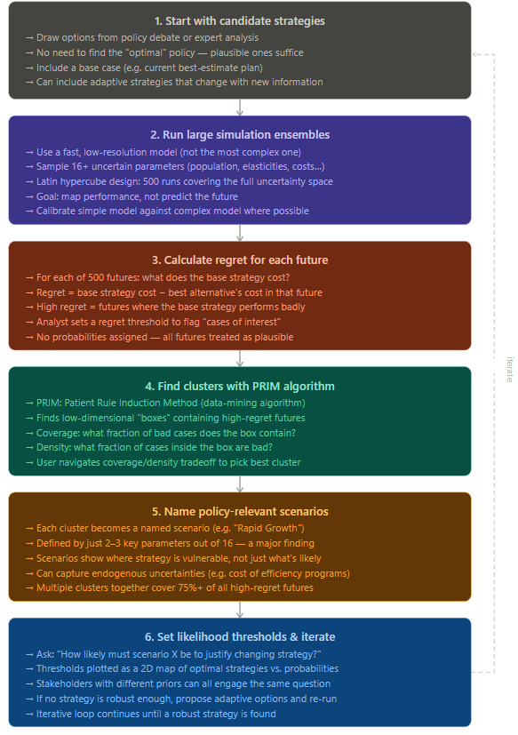

- Robust Decision Making (RDM) [[R: grovesNewAnalyticMethod2007a]]:
	- RDM is designed for situations of *deep uncertainty* — conditions where decision makers cannot agree on (or confidently specify) the system model, the probability distributions over future states, or even the value function for ranking outcomes. Traditional expected-utility analysis is seen as inadequate here because it forces analysts to pick a single probability distribution and optimize against it, which can produce overconfident and brittle recommendations.
	- 
		- (claude)
	- **The California Water Planning Example**
	- In the paper's application, a 16-parameter model of Southern California water demand was run 500 times. PRIM identified two clusters capturing 75% of all poor-performing futures for the base case strategy: a *Rapid Growth* scenario (high population, low natural conservation) and a *Soft Landing* scenario (low population growth, high natural conservation but expensive efficiency programs). Only 3 of the 16 uncertain parameters turned out to matter most — a key finding that traditional scenario methods relying on expert judgment had missed.