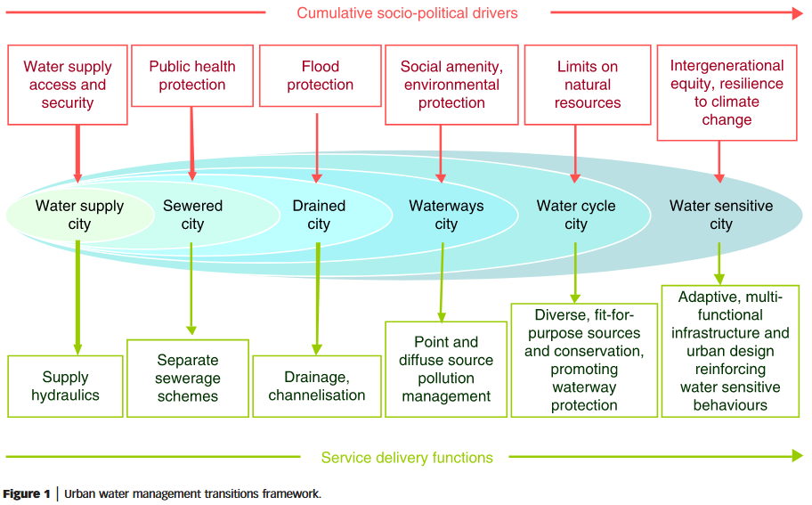

- [[R: brownUrbanWaterManagement2009]] Focus on Australia and from 2009:
	- Institutions Infrastructure
		- hard: formal organisational structures, departments and formal committees, laws,...
		- soft: social relations, informal networks, administrative routines, professional culture, social worlds,..
	- Institutions defined:
		- Coginitive
		- Normative
		- Regulative
		-
	- Transition process:
	  
	-
-
-