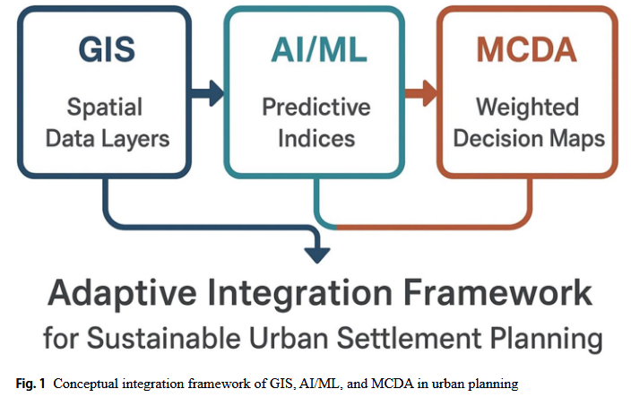

- [[R: rayIntegratingGeographicInformation2025]]
- {:height 350, :width 532}
- **Further compounding the issue is inconsistent data resolution and format interoperability. For example, remote sensing data may be in raster format with pixel-level classification, while planning data (e.g., zoning policies or census tracts) exists in vector or tabular formats. Ensuring these layers align spatially and semantically requires extensive pre-processing—often beyond the capability or resources of many planning units. Data infrastructure is another area of concern. Many cities lack centralized spatial data repositories, real-time data capture mechanisms, or cloud-based processing infrastructure. Without these, it is difficult to establish the integrated systems necessary for dynamic urban planning.**
-
- **Evaluation of the framework:**
	- Model Accuracy (AI/ML)
	- MCDA Consistency Checks: In AHP, consistency ratios are used to ensure logical coherence in pairwise comparisons. Fuzzy MCDA models require sensitivity analysis
	- Spatial Validation: GIS outputs should be validated against ground truth data, field surveys, or historical maps. Overlay analysis and zonal statistics help assess the spatial coherence of results.
	- Scenario Robustness: Testing different weight combinations or model assumptions helps assess stability under uncertainty—especially important in participatory MCDA frameworks.
- **Benefits of the framework**
	- Holistic Decision-Making: The framework enables planners to analyze spatial, social, and economic dimensions concurrently.
	- Predictive Capability: AI/ML components allow anticipation of growth trends, hazard zones, and infrastructure demands.
	- Transparent Evaluation: MCDA introduces transparency and structure to complex planning decisions, especially under trade-offs.
	- Dynamic and Adaptive: Systems can update based on real-time data and policy changes, allowing responsive governance.
- **Barriers**
	- Technical Complexity: Integration requires expertise across GIS, programming, AI/ML modelling, and decision science, which may not be readily available in all planning departments.
	- Data Challenges: Inconsistent, outdated, or missing data—especially in low-income cities—limits analytical depth.
	- Institutional Resistance: Planners accustomed to traditional workflows may resist adopting AI-based or algorithmic decision systems.
	- Ethical Risks: Bias in algorithms, opaque decision processes, and unequal digital access can reinforce existing urban inequalities
- ### Review/Theoretical/Framework paper:
	- open data platforms, crowdsourced mapping, and participatory GIS offers new opportunities for community involvement and transparency in urban planning processes [[R: inclezanViewpointCriticalView2017]], [[R: tadesaedosaUrbanGrowthAssessment2024]]
	- cloud GIS and open-source spatial tools have also democratized access, enabling more inclusive and transparent planning processes [[R: enoguanbhorLandCoverChange2019a]]
	- fuzzy MCDA, entropy weighting, and hybrid AHP-TOPSIS models have further improved the robustness and adaptability of these tools [[R: nyimbiliHybridApproachIntegrating2020]] [[R: rayUnveilingGroundwaterGems2025]]
	- Budha et al. (2025) proposed an integrated Geo-AI and MCDA workflow for predictive land-use modeling [[R: budhaMachineLearningGIS2025]]
	- De Sabbata et al. (2023) noted that contemporary Geo-AI frameworks increasingly blend human expertise with machine-learning outputs [[R: desabbataGeoAIUrbanAnalytics2023]]
	- Emerging technologies such as spatial data infrastructures (SDI), cloud-based urban analytics platforms, and decision support dashboards are enabling such integration[[R: liMachineLearningRemote2023]] [[R: sonAlgorithmicUrbanPlanning2023]]
	- This lack of standardization often necessitates tedious manual conversion or scripting, increasing processing time and the risk of errors [[R: sonAlgorithmicUrbanPlanning2023]]
	- Bousquet et al. (2023) critically reviewed the use of MCDA for green-infrastructure planning, emphasizing the need for participatory weighting and transparent evaluation metrics. [[R: bousquetCriticalReviewMulticriteria2023]]
- ### Summary of Challenges, Gaps, and Proposed Future Directions
  
  
  | Category | Key Issues | Proposed Future Directions |
  |---|---|---|
  | **Technical & Operational** | Platform interoperability hurdles; high computational demands; skill gaps in planning agencies | Develop standardized APIs and data formats; leverage cloud/GPU resources; invest in capacity-building programs |
  | **Data & Infrastructure** | Data scarcity and fragmentation; inconsistent resolutions and formats; lack of centralized repositories | Mandate open data policies; harmonize data schemas; build urban data platforms |
  | **Governance, Ethics & Inclusion** | Centralized decision-making; algorithmic bias and opacity; limited stakeholder engagement | Adopt ethical AI frameworks; enforce transparency and participatory protocols; expand civil-society partnerships |
  | **Research & Methodological Gaps** | Real-time integration lacking; static MCDA weightings; limited cross-scale interoperability | Develop adaptive MCDA models; create streaming data pipelines; research multi-scale frameworks |
  | **Innovation & Policy Alignment** | Slow policy adoption; absence of urban tech sandboxes | Establish policy-tech testbeds; align regulations with emerging tech standards |
- ### AI/ML Applications in Urban Planning (practical paper)
  
  **Source:** Ray, S.K. (2025). Integrating Geographic Information System, Artificial Intelligence, and Multi-Criteria Decision Analysis: A Comprehensive Review for Sustainable Urban Settlement Planning. *Applied Spatial Analysis and Policy*, 18, 155. https://doi.org/10.1007/s12061-025-09762-3
  
  **Section:** AI/ML Models and their Applications in Urban Planning (Section 4)
  
  ---
- #### Urban Growth Forecasting
  
  | Application area | Model / technique | Type | Data source | Key finding / detail | Reference(s) |
  |---|---|---|---|---|---|
  | Urban expansion prediction | Random Forest (RF) | Supervised | Classified satellite imagery (multi-year) | RF achieved 91% accuracy forecasting urban growth hotspots and high-risk expansion corridors in Kathmandu Valley | Bharti & Biswas (2024) |
  | Urban expansion prediction | Support Vector Machine (SVM) | Supervised | Classified satellite imagery | SVM achieved 89% accuracy; performs well with small training samples in spatial classification tasks | Bharti & Biswas (2024); Kwon & Kim (2021) |
  | Urban growth modelling (spatiotemporal) | RF / GBM + Cellular Automata (CA) / Markov Chain hybrid | Hybrid | Time-series LULC data | Hybrid models simulate alternative growth scenarios under policy interventions; outperform standalone ML models in realistic spatial growth simulation | Ou et al. (2019); Tang & Na (2021); Robi & George (2025) |
  | Urban sprawl simulation | Cellular Automata + unsupervised deep learning | Hybrid | Jingjintang Urban Agglomeration, China | Effectively simulated sprawl patterns; integrating CA with deep learning improves temporal prediction accuracy | Ou et al. (2019) |
  | Urban expansion monitoring & forecasting | ML + Remote Sensing | Supervised | Satellite data (Gharbia Governorate, Egypt) | Monitored and forecasted urban expansion using remotely sensed data; supports spatial governance | Mostafa et al. (2021) |
  | Urban growth prediction | Machine learning algorithms | Supervised | Spatial and demographic data, Islamabad | ML-based spatio-temporal monitoring of urban growth; identifies growth drivers and future zones | Khan & Sudheer (2022) |
  | Urban expansion forecasting | ML models (general) | Supervised | Multi-source urban datasets | Optimized urban expansion forecasting using ML; improves accuracy over traditional methods | Abid et al. (2024); Robi & George (2025) |
  
  ---
- #### Land Use / Land Cover (LULC) Classification
  
  | Application area | Model / technique | Type | Data source | Key finding / detail | Reference(s) |
  |---|---|---|---|---|---|
  | LULC mapping | Random Forest (RF) | Supervised | Landsat, Sentinel, MODIS multispectral imagery | High classification accuracy for mapping urban sprawl; handles noisy/incomplete data; robust to overfitting | Kwon & Kim (2021); Fayaz et al. (2022) |
  | LULC classification | Gradient Boosting Machines (GBM / XGBoost) | Supervised | Satellite imagery; LULC transition data, Beijing | Better spatial fit and lower error in LULC transition modelling; captures nonlinear relationships; outperformed logistic regression | Ou et al. (2019) |
  | LULC classification & urban sprawl detection | Multi-Layer Perceptron Neural Network (MLPNN) | Deep Learning | Remote sensing imagery, Kuwait Metropolitan Region | Forecasted high-risk sprawl and built-up area transformation; validated deep learning for arid rapidly developing regions | Al-Dousari et al. (2023) |
  | Object-based LULC classification | ML + Object-Based Image Analysis (OBIA) | Hybrid | High-resolution satellite imagery | Groups pixels into objects then applies ML classifiers using texture, shape, and spectral signatures; significantly improves accuracy in heterogeneous urban areas | Al-Dousari et al. (2023) |
  | Built-up land and settlement mapping | ML on Google Earth Engine | Supervised | Remote sensing data | Compared ML algorithms for mapping built-up areas; demonstrated cloud-based GIS efficiency | Rudiastuti et al. (2021) |
  | Residential building classification | GIS + Machine Learning | Supervised | Urban building data, low/middle-income settings | Classified residential status of urban buildings to support service planning in data-scarce environments | Lloyd et al. (2020) |
  
  ---
- #### Informal Settlement & Slum Detection
  
  | Application area | Model / technique | Type | Data source | Key finding / detail | Reference(s) |
  |---|---|---|---|---|---|
  | Slum / informal settlement detection | CNN — VGGNet, ResNet (transfer learning) | Deep Learning | High-resolution satellite imagery + street-level images | CNN detected 17% more informal settlements with fewer false positives than Decision Trees; automatically extracts spatial texture and material features | Fisher et al. (2022); Ibrahim et al. (2021, 2019) |
  | Slum prediction from street intersections | Machine Learning (predictSLUMS model) | Supervised | Street intersection data, cities | Identifies and predicts informal settlements using street network patterns with ML classifiers | Ibrahim et al. (2019) |
  | Informal settlement change detection | Deep Learning (real-time) | Deep Learning | Updated satellite imagery (temporal) | Monitors growth/densification of informal settlements in real time; supports humanitarian planning | Fisher et al. (2022); Edosa et al. (2024) |
  | Slum mapping + urban scene understanding | Deep Learning (URBAN-i) | Deep Learning | Street-level imagery & satellite data | Multi-task model maps slums, transport modes, and pedestrian activity from urban scenes using computer vision | Ibrahim et al. (2021) |
  | Informal settlement decoding & classification | Machine learning algorithms | Supervised | Remote sensing data, Karachi | Leverages ML for classification and analysis of informal settlements in core urban areas | Ahmed et al. (2025) |
  
  ---
- #### Risk Assessment & Disaster Management
  
  | Application area | Model / technique | Type | Data source | Key finding / detail | Reference(s) |
  |---|---|---|---|---|---|
  | Flood risk mapping | ML classifiers + GIS | Hybrid | Geospatial hazard data | Hybrid GIS–AI models enhance early warning systems and resilient urban planning; used in Lagos, Phnom Penh | Do et al. (2022); Fayaz et al. (2022); Faisal Koko et al. (2021); Thanh Son et al. (2022) |
  | Landslide management | Machine Learning | Supervised | National Highway NH-44, Himalayan terrain, India | ML applied to manage landslide risk along rural–urban transition zones in rugged terrain | Fayaz et al. (2022) |
  | Earthquake risk assessment & microzonation | Fuzzy AHP + Artificial Neural Networks (ANN) + GIS | Hybrid | Geotechnical & building inventory data, Sanandaj, Iran | Integrated fuzzy AHP with ANN for earthquake risk mapping; supports resilience planning and emergency response prioritisation | Yariyan et al. (2020) |
  | Seismic hazard exposure mapping | Machine Learning + GIS | Hybrid | Urban structure data, Greater Cairo | Identified exposure of urban areas to seismic hazard; supports infrastructure vulnerability assessment | Hamdy et al. (2022) |
  | Fire spread risk in informal settlements | GIS-based risk quantification framework | Hybrid | Settlement spatial data, Cape Town | GIS-based framework for conceptualising fire risk in informal settlements; prioritises emergency response | Stevens et al. (2020) |
  | Infrastructure vulnerability assessment | ML models (general) | Supervised | Infrastructure and environmental stressor data | Estimates likelihood of infrastructure failure under flooding, earthquakes, or increased demand; enables preemptive climate adaptation | Yariyan et al. (2020); Irani et al. (2022) |
  
  ---
- #### Urban Morphology & Neighbourhood Classification
  
  | Application area | Model / technique | Type | Data source | Key finding / detail | Reference(s) |
  |---|---|---|---|---|---|
  | Urban zone segmentation & morphology analysis | K-Means Clustering | Unsupervised | Urban spatial datasets | Simple and computationally efficient; identifies homogeneous urban regions and functional neighbourhoods; best as an exploratory spatial tool | Ghazal et al. (2021); Khan & Sudheer (2022); Belinga et al. (2025) |
  | Dimensionality reduction in urban datasets | Principal Component Analysis (PCA) | Unsupervised | Large unlabelled urban datasets | Used for pattern detection and dimensionality reduction in complex multi-variable urban data | Belinga et al. (2025) |
  | Residential neighbourhood classification | Machine Learning (settlement point data) | Supervised | Settlement point data | Identified residential neighbourhood types using ML classification; supports zoning and service allocation | Jochem et al. (2018) |
  | Urban morphology mapping (grid-based) | ML + Remote Sensing | Supervised | Xiamen City data | Grid-based essential urban land use classification using data- and model-driven mapping framework | Wang et al. (2022) |
  
  ---
- #### Transportation & Infrastructure Optimisation
  
  | Application area | Model / technique | Type | Data source | Key finding / detail | Reference(s) |
  |---|---|---|---|---|---|
  | Traffic congestion prediction & transit optimisation | Graph-based ML; Reinforcement Learning (RL) | Supervised | Traffic GPS data, transit maps | Analyses historical traffic and commuter behaviour to design efficient transit networks and predict congestion | Li et al. (2023); Sapienza et al. (2022) |
  | Metro route optimisation | AHP + ML hybrid | Hybrid | Geospatial & engineering data, Tabriz, Iran | ML-enhanced AHP reduced route conflict zones by 22%; improved multi-criteria weighting through adaptive learning | Esmatkhah Irani et al. (2022) |
  | Optimal location of urban facilities | ML (general) + spatial optimisation | Supervised | Spatial + service demand + environmental data | Determines optimal siting for waste management, parks, schools, and emergency services; integrates spatial layers with service demand metrics | Singh (2019); Nyimbili & Erden (2020) |
  | Urban drainage management | Machine Learning | Supervised | Urban drainage data | ML applied to state-of-the-art urban drainage system modelling and management | Kwon & Kim (2021) |
  
  ---
- #### Energy & Environmental Planning
  
  | Application area | Model / technique | Type | Data source | Key finding / detail | Reference(s) |
  |---|---|---|---|---|---|
  | Energy consumption forecasting | SVM; GBM (XGBoost) | Supervised | Smart meter data, demographics, South Asian cities | Predicts electricity usage patterns; enables targeted interventions for energy equity and grid resilience | Reza et al. (2025) |
  | Building energy use modelling | GIS + ML / Neural Networks | Hybrid | Building energy benchmarking data, Seattle | Assessed effect of neighbourhood-level urban form on residential building energy use at city scale | Ahn & Sohn (2019) |
  | AI-driven building energy retrofit optimisation | Multi-objective AI optimisation | Hybrid | Urban building stock data | Multi-objective AI-driven optimisation for sustainable urban building retrofits; advances data-efficient energy planning | Shan et al. (2025) |
  | Biodiversity impact assessment of urban growth | Machine Learning + GIS | Hybrid | Biodiversity indices, LULC, Sululta, Ethiopia | Assessed habitat loss and urban encroachment on conservation zones; integrates ecological datasets with planning tools | Edosa et al. (2024) |
  
  ---
- #### Urban Health, Wellbeing & Smart Cities
  
  | Application area | Model / technique | Type | Data source | Key finding / detail | Reference(s) |
  |---|---|---|---|---|---|
  | Smart healthcare in cities (IoT-based) | ML for smart healthcare systems | Supervised | IoT sensor data, urban health data | ML approaches applied to smart healthcare and city health monitoring in urban environments | Ghazal et al. (2021) |
  | Urban wellbeing assessment during pandemics | Artificial Intelligence techniques | Supervised | Urban space usage data, public sentiment | AI used to assess community wellbeing via urban spaces during pandemics | Salama et al. (2023) |
  | Digital technology adoption in urban health | AI / digital technologies (scoping review) | Supervised | Systematic review data | Scoping review of AI and digital technology adoption in urban health contexts and smart cities | Sapienza et al. (2022) |
  
  ---
- #### Urban Land Suitability & Spatial Decision Support
  
  | Application area | Model / technique | Type | Data source | Key finding / detail | Reference(s) |
  |---|---|---|---|---|---|
  | Urban growth suitability mapping | Random Forest + AHP + GIS | Hybrid | LULC, slope, road network, Kathmandu | Integrated ML with MCDA–GIS for adaptive zoning; identified low-impact development zones under rapid urbanisation | Bharti & Biswas (2024) |
  | 3D spatial planning analysis | ML models + Neural Networks (3D data) | Deep Learning | 3D spatial data, Russian Federation urban district | ML and neural networks applied to analysing 3D data for urban spatial planning tasks | Akylbekov et al. (2022) |
  | Urban architecture analysis (image recognition) | AI + GIS image recognition | Deep Learning | Urban architectural imagery | AI-based image recognition for analysing modern architectural art and urban form | Huang et al. (2021) |
  | Urban real estate price prediction | ML methods (systematic survey) | Supervised | Real estate data | Systematic survey of AI-based ML methods for urban real estate price prediction; supports investment and zoning decisions | Tekouabou et al. (2024) |
  | Urban data classification for AI planning systems | Machine Learning | Supervised | Urban data sources (heterogeneous) | Identifies and classifies urban data sources suitable for ML-based sustainable urban planning and decision support systems | Téhouabou et al. (2022) |
  | Settlement growth assessment & suitability | ML framework for urban growth | Supervised | Multi-source urban data | ML framework assessing urban growth of cities and land suitability for planning decisions | Gharaibeh et al. (2023) |
  
  ---
- ## Key References (cited in tables above)
- Abid et al. (2024). Asian Journal of Civil Engineering, 25(6), 4673–4682.
- Ahmed et al. (2025). Remote Sensing in Earth Systems Sciences, 8(1), 307–320.
- Ahn & Sohn (2019). Energy and Buildings, 196, 124–133.
- Akylbekov et al. (2022). Advances in Engineering Software, 173, 103251.
- Al-Dousari et al. (2023). The Egyptian Journal of Remote Sensing and Space Science, 26(2), 381–392.
- Belinga et al. (2025). Data & Policy, 7, e2.
- Bharti & Biswas (2024). Journal of Geovisualization and Spatial Analysis, 8(2), 40.
- Do et al. (2022). Ecological Informatics, 72, 101912.
- Edosa et al. (2024). City and Environment Interactions, 23, 100151.
- Esmatkhah Irani et al. (2022). Geotechnical and Geological Engineering, 40(10), 5081–5102.
- Faisal Koko et al. (2021). Geomatics, Natural Hazards and Risk, 12(1), 631–652.
- Fayaz et al. (2022). Land, 11(6), 884.
- Fisher et al. (2022). Remote Sensing, 14(13), 3072.
- Gharaibeh et al. (2023). Land, 12(1), 214.
- Ghazal et al. (2021). Future Internet, 13(8), 218.
- Hamdy et al. (2022). Sustainability, 14(17), 10722.
- Huang et al. (2021). Arabian Journal of Geosciences, 14, 1–13.
- Ibrahim et al. (2019). Computers, Environment and Urban Systems, 76, 31–56.
- Ibrahim et al. (2021). Environment and Planning B, 48(1), 76–93.
- Jochem et al. (2018). Computers, Environment and Urban Systems, 69, 104–113.
- Khan & Sudheer (2022). The Egyptian Journal of Remote Sensing and Space Science, 25(2), 541–550.
- Kwon & Kim (2021). Water, 13(24), 3545.
- Li et al. (2023). Sustainable Cities and Society, 96, 104653.
- Lloyd et al. (2020). Remote Sensing, 12(23), 3847.
- Mostafa et al. (2021). Remote Sensing, 13(22), 4498.
- Nyimbili & Erden (2020). ISPRS International Journal of Geo-Information, 9(7), 419.
- Ou et al. (2019). Sustainability, 11(9), 2464.
- Reza et al. (2025). Journal of Computer Science and Technology Studies, 7(1), 265–282.
- Robi & George (2025). Journal of Urban Planning and Development, 151(2), 03125001.
- Rudiastuti et al. (2021). Geoinformation Science Symposium 2021, 12082, 42–52.
- Salama et al. (2023). Ain Shams Engineering Journal, 14(5), 102084.
- Sapienza et al. (2022). Sustainability, 14(12), 7480.
- Shan et al. (2025). Applied Sciences, 15(16), 8944.
- Singh (2019). Journal of Environmental Management, 243, 22–29.
- Stevens et al. (2020). International Journal of Disaster Risk Reduction, 50, 101736.
- Tang & Na (2021). Journal of Rock Mechanics and Geotechnical Engineering, 13(6), 1274–1289.
- Tekouabou et al. (2024). Archives of Computational Methods in Engineering, 31(2), 1079–1095.
- Téhouabou et al. (2022). Data, 7(12), 170.
- Thanh Son et al. (2022). Geocarto International, 37(22), 6625–6642.
- Wang et al. (2022). Remote Sensing, 14(23), 6143.
- Yariyan et al. (2020). International Journal of Disaster Risk Reduction, 50, 101705.
- ---
-
-
-
- ---
-
- ## Notes on newly added references
-
-