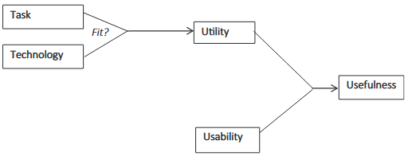
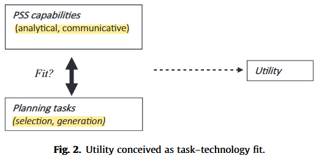

tags:: PSS, Method

- Measures to PSS:
	- Performance (unambiguous conceptual building block)
	- Effectiveness
		- Instrument
		- Influence of Instrument
	- Added Value
		- positive influence of PSS
	- Usefulness #card
	  card-last-interval:: 9.28
	  card-repeats:: 3
	  card-ease-factor:: 2.32
	  card-next-schedule:: 2026-04-01T15:04:31.013Z
	  card-last-reviewed:: 2026-03-23T09:04:31.013Z
	  card-last-score:: 5
		- ‘issue of whether the system can be used to achieve some desired goals’.
		- PSS usefulness interrelated dimensions:
			- 1) kinds of usefulness:
			  | Kind of usefulness | Definition |
			  |---|---|
			  | Learning about the object | Gaining insight into the nature of the planning object |
			  | Learning about other stakeholders | Gaining insight into the perspective of other stakeholders in planning |
			  | Collaboration | Interaction and cooperation among the stakeholders involved |
			  | Communication | Sharing information and knowledge among the stakeholders involved |
			  | Consensus | Agreement on problems, solutions, knowledge claims and indicators |
			  | Efficiency | The same or more tasks can be conducted with smaller investments |
			  | Better informed plans or decisions | A decision or outcome is based on better information and/or a better consideration of the information |
			- 2) help achieving desired goals
		- 2 explanatory Usefulness variables: 
		  card-last-interval:: 4
		  card-repeats:: 1
		  card-ease-factor:: 2.6
		  card-next-schedule:: 2026-03-17T15:25:31.344Z
		  card-last-reviewed:: 2026-03-13T15:25:31.344Z
		  card-last-score:: 5
		  {:height 209, :width 512}
			- Utility
				- ‘utility is the question of whether the functionality of the system in principle can do what is needed’
				- In PSS context: is it doing what it needed?
				- 
				- selection task = decision-making tasks (exploitation) (closing down)
				- generation task = generate solutions (exploration) (opening up)
				- analytical support = improve understanding of planning issue
				- communication support = improve communication between stakeholders
			- Useability
				- how well users can use that [utility] functionality’
				- Usability Variables:
				  | Usability variable | Description |
				  |---|---|
				  | Transparency | The extent to which the underlying models and variables of the PSS are visible to users |
				  | User friendliness | The extent to which participants are able to use the tool themselves |
				  | Interactivity | The extent to which the tool can directly respond to the users' questions and suggestions |
				  | Flexibility | The extent to which the tool can be applied for different planning tasks |
				  | Calculation time | The time participants have to wait before an analysis is completed |
				  | Data quality | The extent to which the input data is considered valid |
				  | Level of detail | The extent to which the level of detail of the tool matches the perspective of participants |
				  | Integrality | The extent to which the tool takes all the relevant dimensions into account |
				  | Reliability | The extent to which the outcomes of the tool are considered reliable |
				  | Communicative value | The extent to which the visual output is useful for the participants |
		-
		-
-
- [[Case Studys of PSS Usefulness Framework]]
- ---
- [[pelzerUsefulnessPlanningSupport2017a]]
	-