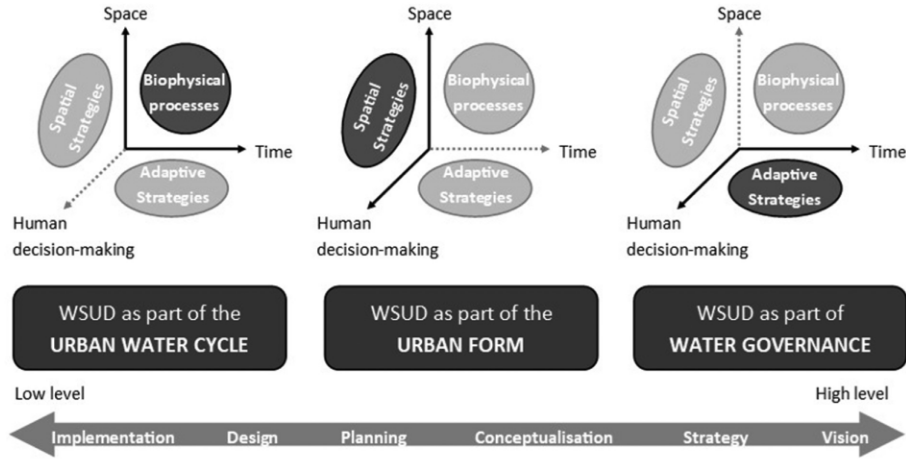
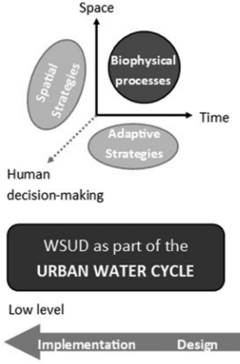
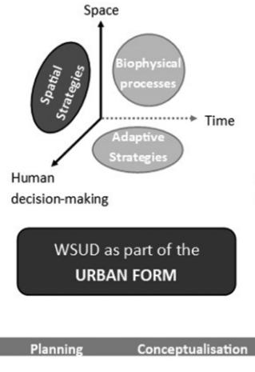
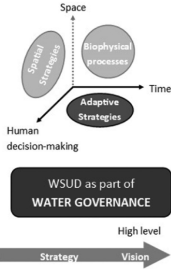

tags:: [NbS, WSUD, PSS, Planning]

-
-
- While this all talks about WSUD, it can mean urban NbS
-
- Criteria for successful urban planning:
	- holistic approach taking technical, social, economic, and environmental factors into account
	- considers all relevant scales
	- Engaging all relevant stakeholders, effective communication and cooperation
- {:height 409, :width 778}
-
- ## WSUD as Part of the Urban Water Cycle #card
  card-last-interval:: -1
  card-repeats:: 1
  card-ease-factor:: 2.5
  card-next-schedule:: 2026-03-12T23:00:00.000Z
  card-last-reviewed:: 2026-03-12T08:10:16.211Z
  card-last-score:: 1
	-  
	  These tools operate at the lowest, most technical level — they model water flows and drainage system performance. They are primarily used during the design and implementation phases of WSUD, and are rooted in civil engineering.
	- ### 1. Water Balance Models
	  
	  These simulate the total inflow and outflow of water for a given area (a household, precinct, or whole city) over a set timeframe. They help planners understand how much water moves through an urban system and where it goes.
	  
	  Examples include:
	- **UVQ / Aquacycle** — comprehensively model the total urban water cycle at various scales
	- **Urban Developer** — flexible, modular tool that simulates the water cycle at different spatial and temporal scales
	- **City Water Balance** — used for city-scale scenario analysis of water balance options
	- **UWOT** — works with multiple units of water quality measurement for integrated assessment
	-
	- ### 2. Hydrological and Hydraulic Models
	  
	  These assess and predict how water flows through piped drainage and sewerage systems. In WSUD planning, they are mainly used for detailed infrastructure design and checking compliance against engineering standards.
	  
	  Examples include:
	- **SWMM** — widely used US model for simulating urban drainage components and calculating hydrological and pollution impacts
	- **MUSIC** — the Australian equivalent, similarly widely applied for WSUD implementation
	- **PURRS** — designed specifically for rain tank modelling in Australia, but can model the broader urban water cycle
	- ### Key Limitation
	  
	  While these tools are technically rigorous, the paper argues they are too narrowly focused on *how water behaves* and do not account for the broader planning context — things like land ownership, community values, or where green infrastructure would deliver the most benefit. They treat WSUD as an engineering problem rather than an urban planning one.
- ## WSUD as Part of the Urban Form #card
  card-last-interval:: 4
  card-repeats:: 1
  card-ease-factor:: 2.36
  card-next-schedule:: 2026-03-16T08:10:42.842Z
  card-last-reviewed:: 2026-03-12T08:10:42.842Z
  card-last-score:: 3
	- 
	- These tools sit in the middle of the three categories — they treat WSUD planning as a *location choice*, asking where in the city green infrastructure should go. The paper considers this the most relevant category for best planning practice.
	- ### 1. Planning Simulation
	  
	  These tools simulate spatial layouts of an urban water system, taking into account urban form and hydrology. They are relatively new and less well known in practice.
	  
	  Examples include:
	- **UrbanBEATS** — uses biophysical factors, urban form, and planning regulations to algorithmically place WSUD assets across a city
	- **SUSTAIN-EPA (siting module)** — similar spatial placement functionality developed by the US EPA
	- ### 2. Technology Selection
	  
	  These tools use Multi-Criteria Decision Analysis (MCDA) to rank and rate WSUD technologies based on their suitability for a given location or context. They are *not* spatially explicit — they help you choose *what* technology to use once a location has already been chosen.
	  
	  Examples include:
	- **SUDSLOC** — the most rigorous academic tool in this category; combines hydraulic modelling with technology-specific MCDA across biophysical, socio-economic, and planning criteria
	- **Climate App** — a Dutch web-based tool that lets users select goals and settings to find suitable WSUD technologies
	- **GreenBlue Grids** — similar web-based application for ranking technologies against user-defined criteria
	- ### 3. Technology Evaluation
	  
	  Similar to selection tools, but focused on assessing and quantifying the *multiple benefits* of WSUD technologies, particularly their economic value. Useful for justifying investment decisions.
	  
	  Examples include:
	- **NYC Green Infrastructure Co-Benefits Calculator** — web-based tool quantifying economic and environmental co-benefits
	- **BeST (Benefits of SuDS Tool)** — Excel-based tool capturing amenity, ecological, and flood mitigation values
	- **E2STORMED** — most comprehensive in this category; evaluates drainage scenarios across economic, socio-economic, environmental, and energy criteria
	- ### 4. Spatial Suitability Evaluation (GIS-MCDA)
	  
	  These are the tools the paper focuses on most, and considers most promising. **GIS-MCDA** combines Geographic Information Systems with multi-criteria analysis to produce spatially explicit suitability maps — essentially heat maps showing where in a city WSUD is most and least suitable.
	  
	  The process generally involves four steps:
	  1. **Value scaling** — translating raw data into suitability scores
	  2. **Criterion weighting** — assigning relative importance to each factor
	  3. **Combination rules** — calculating an overall suitability score
	  4. **Spatial representation** — producing a suitability map
	  
	  The paper reviews 16 existing GIS-MCDA tools and assessments in water management and finds that **none** combine a high complexity of factors with a sophisticated methodology. Most focus only on a small number of biophysical factors and ignore socio-economic, governance, and ecosystem service dimensions entirely.
	- ### Key Limitation
	  
	  The paper's central critique of this whole category is that existing tools only address one side of suitability — *what WSUD needs from a location* — and ignore the other side: *what a location needs from WSUD*. This is the gap the paper's proposed suitability framework is designed to fill.
	-
- ---
- ## WSUD as Part of Water Governance #card
  card-last-interval:: -1
  card-repeats:: 1
  card-ease-factor:: 2.5
  card-next-schedule:: 2026-03-12T23:00:00.000Z
  card-last-reviewed:: 2026-03-12T08:08:55.976Z
  card-last-score:: 1
	- 
	- Water governance tools operate at the highest, most strategic level — they're about shifting an entire city's water management culture and policy over the long term, not about where to place specific infrastructure.
	- ### 1. Complex System Models
	  
	  These simulate how cities *transition* from conventional grey infrastructure to more sustainable, green water management. They model the city as a living system where engineers, politicians, residents, and developers all interact.
	  
	  A key example is **agent-based modelling**, where a computer simulates individual "agents" (households, local governments, developers) making decisions to observe what happens at the city scale over time. One study simulated how homeowners gradually adopt raingardens and green roofs based on incentives. The goal is less about precise prediction and more about understanding *why* change is slow and what might accelerate it.
	- ### 2. Transition Frameworks
	  
	  These are conceptual tools — diagrams and frameworks rather than software — that help planners understand where their city currently sits on the road to sustainable water management, and what needs to change institutionally to move forward.
	  
	  The key example is the **Water Sensitive City Continuum**, which maps cities along a spectrum from "just drain it away" thinking to a fully water-sensitive city. An associated index tool lets cities measure their current "transition state." These frameworks don't tell you where to put infrastructure — they help decision-makers have the right *conversations* about systemic change.
	- ### 3. Scenario Analyses
	  
	  These tools ask "what *could* happen?" rather than "what *will* happen?" — useful given uncertainty around climate change, population growth, and political shifts. Multiple plausible futures are built and tested against different policy or infrastructure choices.
	  
	  Examples include:
	- **DAnCE4Water** — combines social, ecological, and urban development dynamics to support adaptive policy-making under deep uncertainty
	- **VIBe** — virtually simulates thousands of city configurations to test resilience under different climate or growth scenarios, without needing real-world data for each case
	- ### Key Limitation
	  
	  The paper notes that while these tools are important for creating the political and institutional conditions for WSUD to succeed, none of them help with *spatially planning where* to put green infrastructure. Addressing that gap is the main contribution of the rest of the paper.
	-
	- ---
- [[kullerFramingWaterSensitive2017]]